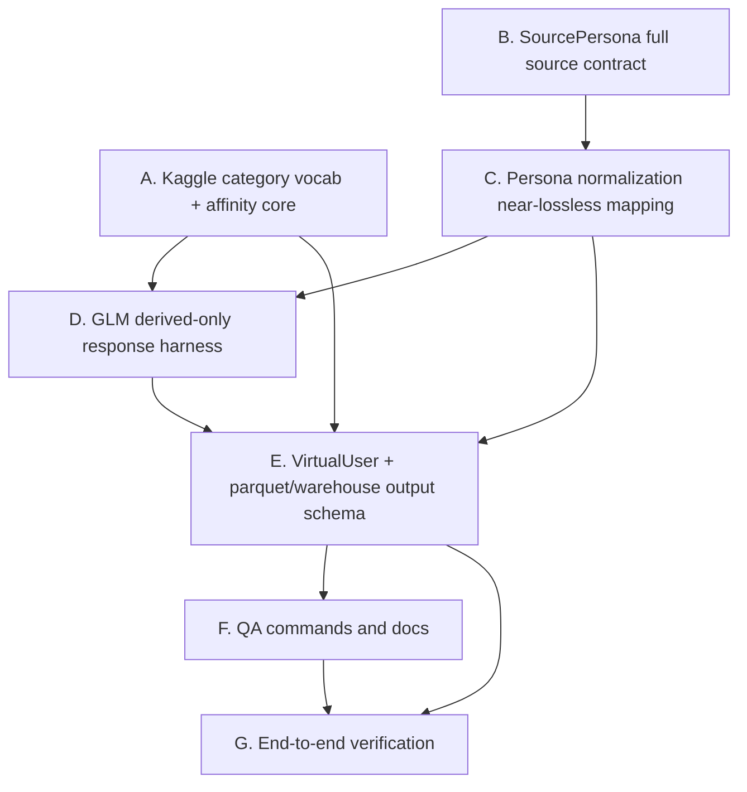

# 무손실 Persona Virtual User Subagent 구현 실행계획

> 기준 문서: `autoresearch/virtual_users/docs/무손실_persona_virtual_user_구현계획.md`

## 목표

기존 구현 계획을 subagent가 맡기 쉬운 작업 단위로 재구성한다. 핵심은 원본 persona 26개 컬럼을 모두 보존하고, GLM은 derived feature만 생성하며, category affinity는 코드가 deterministic하게 계산하도록 만드는 것이다.

## 운영 원칙

- 같은 worktree에서는 구현 subagent를 동시에 여러 개 실행하지 않는다. `schema.py`, `glm_generator.py`, 테스트 파일 충돌 가능성이 높다.
- 병렬 실행은 별도 git worktree를 만들었을 때만 허용한다.
- 같은 worktree에서는 아래 wave 순서대로 진행하고, 각 subagent 작업 뒤에 spec review와 code quality review를 수행한다.
- read-only 조사나 문서 검토 subagent는 병렬 가능하다.
- 각 구현 subagent는 맡은 파일 범위를 벗어난 리팩터링을 하지 않는다.

## 의존성 그래프



## 병렬 가능 작업

아래 작업은 직접적인 코드 의존성이 적다. 별도 worktree라면 병렬로 시작할 수 있다.

| Subagent | 작업 | 주요 파일 | 병렬 가능 조건 |
|---|---|---|---|
| A | Kaggle category vocabulary와 deterministic affinity 계산 함수 구현 | `autoresearch/virtual_users/categories.py`, `tests/test_virtual_users_categories.py` | 새 파일 중심이므로 B와 병렬 가능 |
| B | `SourcePersona` full source contract 확장 | `autoresearch/virtual_users/schema.py`, `tests/test_virtual_users_schema.py` | A와 병렬 가능. C/D/E와는 충돌 가능 |
| F0 | QA 문서 초안 작성 | `autoresearch/virtual_users/docs/*.md` | read-only/문서 작업이면 병렬 가능. 최종 명령은 E 이후 보정 필요 |

## 의존성 있는 작업

아래 작업은 선행 작업 결과에 의존하므로 순차로 진행한다.

| 순서 | Subagent | 선행 조건 | 이유 |
|---|---|---|---|
| 1 | B | 없음 | 모든 downstream schema의 기반 |
| 2 | C | B 완료 | normalization은 확장된 `SourcePersona` 필드에 값을 채워야 함 |
| 3 | A | 없음 | D/E에서 category validation과 affinity 계산을 사용 |
| 4 | D | A, C 완료 | GLM prompt가 full source payload와 allowed category vocab을 사용해야 함 |
| 5 | E | A, C, D 완료 | `VirtualUser`는 source factual field + derived features + affinity 결과를 합쳐야 함 |
| 6 | F | E 완료 | 실제 출력 경로와 schema가 확정된 뒤 QA 명령을 문서화해야 함 |
| 7 | G | 전체 완료 | 2건/100건 end-to-end 검증 |

## 권장 Wave 구성

### Wave 1: 독립 기반 작업

별도 worktree가 있으면 A와 B를 병렬 실행한다. 같은 worktree라면 B를 먼저 하고 A를 한다.

#### Subagent A: Category Vocab And Affinity Core

**목표:** Kaggle YouTube category vocabulary 검증과 deterministic affinity 계산을 독립 모듈로 만든다.

**파일:**
- 생성: `autoresearch/virtual_users/categories.py`
- 생성: `tests/test_virtual_users_categories.py`

**구현 범위:**
- `DEFAULT_KAGGLE_YOUTUBE_CATEGORIES`
- `validate_categories(categories, allowed)`
- `build_category_affinity(primary_categories, category_evidence, allowed_categories)`

**완료 조건:**
- `Travel`은 reject되고 `Travel & Events`는 accept된다.
- 동일한 ranking/evidence 입력에 대해 동일한 affinity가 나온다.
- `schema.py`, `glm_generator.py`, `pipeline.py`는 건드리지 않는다.

#### Subagent B: Full SourcePersona Contract

**목표:** `SourcePersona`가 NVIDIA persona raw 26개 컬럼과 helper field를 모두 담을 수 있게 한다.

**파일:**
- 수정: `autoresearch/virtual_users/schema.py`
- 수정: `tests/test_virtual_users_schema.py`

**구현 범위:**
- raw source 컬럼 전체 추가
- `country_code`, `locale`, `source_text`, `source_hash`, `raw_payload` 추가
- 기존 fixture가 깨지지 않도록 기본값 설정

**완료 조건:**
- full source contract 테스트 통과
- 기존 schema 테스트 통과

### Wave 2: Source 변환 통합

#### Subagent C: Near-Lossless Persona Normalization

**선행 조건:** B 완료

**목표:** raw parquet row를 정보 손실 없이 `SourcePersona`로 변환한다.

**파일:**
- 수정: `autoresearch/virtual_users/persona_source.py`
- 수정: `tests/test_virtual_users_persona_source.py`

**구현 범위:**
- list-like string을 `list[str]`로 안정적으로 파싱
- raw column 전체 매핑
- `source_text` 구성
- `source_hash` 생성
- `raw_payload` 보존
- `sex="여자"/"남자"` 정상 처리 확인

**완료 조건:**
- raw 26개 컬럼 보존 테스트 통과
- 실제 parquet 샘플 2건을 `SourcePersona`로 변환 가능

### Wave 3: GLM Harness 변경

#### Subagent D: Derived-Only GLM Harness

**선행 조건:** A, C 완료

**목표:** GLM이 factual field를 만들지 않고, derived feature만 만들도록 prompt와 parser를 바꾼다.

**파일:**
- 수정: `autoresearch/virtual_users/schema.py`
- 수정: `autoresearch/virtual_users/glm_generator.py`
- 수정: `tests/test_virtual_users_glm_generator.py`

**구현 범위:**
- `DerivedVirtualUserFeatures` 추가
- system harness 추가
- user prompt에 full source payload와 allowed category vocab 포함
- GLM response는 derived-only schema로 검증
- `generation_meta`는 여전히 코드가 stamp

**완료 조건:**
- GLM 테스트가 derived-only response 기준으로 통과
- GLM이 `age`, `sex`, `occupation` 같은 factual field를 출력하지 않아도 파이프라인이 동작할 준비가 됨

### Wave 4: VirtualUser 출력 통합

#### Subagent E: VirtualUser Merge And Output Schema

**선행 조건:** A, C, D 완료

**목표:** source factual field와 GLM derived feature를 병합해서 warehouse/parquet row를 만든다.

**파일:**
- 수정: `autoresearch/virtual_users/schema.py`
- 수정: `autoresearch/virtual_users/pipeline.py`
- 수정: `tests/test_virtual_users_schema.py`
- 수정: `tests/test_virtual_users_pipeline.py`

**구현 범위:**
- `VirtualUser`에 source factual field 확장
- keyword group, `category_evidence`, `source_persona_json` 추가
- deterministic `category_affinity` 적용
- parquet schema 37컬럼에서 확장
- warehouse JSONL row 확장

**완료 조건:**
- `source_persona_json`이 비어 있지 않음
- factual field는 source에서 복사됨
- `primary_categories`는 allowed Kaggle category만 포함
- parquet와 warehouse JSONL 테스트 통과

### Wave 5: QA 문서와 실행 검증

#### Subagent F: QA Docs

**선행 조건:** E 완료

**목표:** 2건 smoke test와 100건 생성/검증 명령을 문서화한다.

**파일:**
- 수정 또는 생성: `autoresearch/virtual_users/docs/lossless_persona_virtual_user_qa.md`

**구현 범위:**
- 20대 여성 1명/남성 1명 smoke command
- `male_count=50`, `female_count=50` 100건 생성 command
- DuckDB/PyArrow 검증 쿼리
- `ZAI_API_KEY` User env 주입 안내

**완료 조건:**
- 새 개발자가 문서만 보고 로컬 2건 QA를 재현 가능
- 100건 생성 전후 검증 명령이 명확함

#### Subagent G: End-To-End Verification

**선행 조건:** F 완료, `ZAI_API_KEY` 사용 가능

**목표:** 전체 테스트와 실제 GLM 생성 경로를 검증한다.

**파일:**
- 코드 수정 없음. 필요 시 실패 원인만 보고.

**검증 범위:**
- focused pytest
- 샘플 UUID 2건 생성
- 최대 100건 생성
- parquet row count
- raw snapshot row count
- warehouse JSONL line count
- invalid category count
- missing source JSON count

**완료 조건:**

```text
parquet_rows=100
raw_snapshot_rows=100
warehouse_jsonl_lines=100
invalid_category_count=0
missing_source_json_count=0
```

## 같은 Worktree에서의 안전한 실행 순서

같은 worktree를 쓸 때는 병렬 구현 대신 아래 순서를 권장한다.

```text
1. Subagent B: SourcePersona full source contract
2. Subagent C: Near-lossless persona normalization
3. Subagent A: Category vocab and affinity core
4. Subagent D: Derived-only GLM harness
5. Subagent E: VirtualUser merge and output schema
6. Subagent F: QA docs
7. Subagent G: End-to-end verification
```

이 순서는 schema 충돌을 최소화한다.

## 별도 Worktree 사용 시 병렬 실행안

별도 worktree를 만들 수 있다면 아래처럼 나눌 수 있다.

```text
Parallel batch 1:
- Worktree A: Subagent A
- Worktree B: Subagent B
- Worktree F0: QA 문서 초안

Integration batch 2:
- Subagent C after B
- merge A + B + C

Sequential batch 3:
- Subagent D
- Subagent E
- Subagent F final docs
- Subagent G verification
```

단, A와 B 결과를 merge한 뒤 D/E를 진행해야 한다.

## Reviewer 배치

각 구현 subagent 완료 후 두 리뷰를 붙인다.

1. **Spec compliance reviewer**
   - 계획 문서 요구사항 충족 여부 확인
   - 누락된 source column, GLM factual field 재생성, category vocab 미검증 여부 확인

2. **Code quality reviewer**
   - 테스트 품질
   - schema 중복
   - JSON string/nested parquet 선택의 일관성
   - 깨지기 쉬운 문자열 파싱
   - 한글/UTF-8 처리

최종적으로 전체 구현 후 final reviewer를 한 번 더 실행한다.

## Subagent별 프롬프트 요약

### A 프롬프트 핵심

```text
Kaggle YouTube category vocabulary와 deterministic category_affinity 계산만 구현하라.
schema.py/glm_generator.py/pipeline.py는 수정하지 마라.
Travel은 reject, Travel & Events는 accept되게 테스트하라.
```

### B 프롬프트 핵심

```text
SourcePersona가 NVIDIA persona raw 26개 컬럼 전체와 helper field를 보존하게 하라.
정보를 축약하거나 제거하지 마라.
기존 fixture가 깨지지 않도록 기본값을 둬라.
```

### C 프롬프트 핵심

```text
source_persona_from_record()를 무손실 정규화에 가깝게 바꿔라.
raw_payload/source_hash/source_text를 생성하고, 원본 여자/남자 성별값은 raw_payload에 보존하되 SourcePersona.sex는 male/female로 정상화하라.
```

### D 프롬프트 핵심

```text
GLM은 derived feature만 출력하게 하라.
system harness를 추가하고, prompt에 full source와 allowed category vocab을 넣어라.
factual field는 GLM 응답에서 받지 마라.
```

### E 프롬프트 핵심

```text
SourcePersona factual fields와 DerivedVirtualUserFeatures를 병합해 VirtualUser를 만들어라.
category_affinity는 GLM 응답이 아니라 categories.py의 deterministic 함수로 계산하라.
parquet/warehouse output schema를 확장하라.
```

### F 프롬프트 핵심

```text
2건 smoke test와 100건 생성 QA 명령을 문서화하라.
PowerShell User env의 ZAI_API_KEY 주입 방법과 DuckDB 검증 쿼리를 포함하라.
```

### G 프롬프트 핵심

```text
코드를 수정하지 말고 전체 검증을 수행하라.
실패하면 실패 지점, 재현 명령, 원인을 보고하라.
```

## 실행 전 확인사항

- 현재 branch가 `42-feat-glm-기반-virtual-user-parquet-생성-파이프라인`인지 확인한다.
- `Nemotron-Personas-Korea/data/*.parquet`가 로컬에 있는지 확인한다.
- `ZAI_API_KEY`는 User env 또는 현재 shell env에 있어야 한다.
- PowerShell UTF-8 profile이 적용되어 한글 문서/파일명 출력이 깨지지 않아야 한다.
- 같은 worktree에서 병렬 구현 subagent를 실행하지 않는다.
