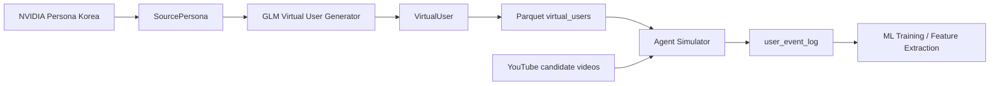

# NVIDIA Persona 기반 Virtual User 생성 구현계획

## 목표

NVIDIA Persona Korea 원본 row를 최대한 보존한 뒤, YouTube reranking과 click simulation에 바로 사용할 수 있는 `virtual_users` 데이터를 만든다.

최종 `VirtualUser`는 다음 단계에서 사용된다.

- 실시간 후보 영상 200개를 개인별로 reranking
- persona 기반 keyword matching
- 클릭 여부와 시청 카테고리 기반 `user_event_log` 생성
- ML training / feature extraction 입력 데이터 구성

## 현재 결정사항

- 저장 포맷은 Parquet을 기본값으로 사용한다.
- LLM provider는 Z.ai의 GLM-5.2를 사용한다.
- GLM 호출은 OpenAI-compatible API로 연결한다.
- 실행 metadata는 LLM이 만들지 않고 코드가 한 번만 stamp한다.
- `hobby_keywords`는 virtual user table의 필수 컬럼이다.
- 브랜치 운영이나 PR 처리 내용은 이 계획서에 넣지 않는다.

## 권장 환경 변수

```text
ZAI_API_KEY=...
ZAI_BASE_URL=https://api.z.ai/api/coding/paas/v4
```

`ZAI_BASE_URL`은 기본값으로 위 coding endpoint를 사용하되, 테스트나 계정 설정에 따라 환경 변수로 바꿀 수 있게 둔다.

## 데이터 흐름



## SourcePersona 설계

`SourcePersona`는 Hugging Face 원본 row를 최대한 보존하는 raw-normalized layer다.

필요한 개선:

- NVIDIA Persona source row의 주요 필드를 누락 없이 매핑한다.
- `source_persona_from_record()`가 일부 필드만 고르는 구조를 줄인다.
- invalid row는 `SourcePersona` validation 이후에만 제외한다.
- raw snapshot을 만들 경우 skip된 invalid row는 넣지 않는다.
- streaming load에서 `max_records=None`으로 전체 원본 row를 무제한 누적하는 경로를 조심한다.

## VirtualUser 필수 컬럼

reranking과 event simulation에 필요한 feature layer다.

필수 식별/출처 컬럼:

- `virtual_user_id`
- `source_uuid`
- `source_dataset`
- `age`
- `sex`
- `age_bucket`
- `occupation`
- `province`
- `district`
- `country`
- `locale`

필수 persona 요약/관심사 컬럼:

- `persona_summary`
- `hobby_keywords`
- `interest_keywords`
- `category_affinity`

필수 YouTube behavior 컬럼:

- `youtube_profile.primary_categories`
- `youtube_profile.shorts_affinity`
- `youtube_profile.longform_affinity`
- `youtube_profile.trend_sensitivity`
- `youtube_profile.comment_propensity`
- `youtube_profile.watch_time_band`

필수 생성 metadata:

- `generation_meta.schema_version`
- `generation_meta.prompt_version`
- `generation_meta.llm_model`
- `generation_meta.generated_at`

## GLM Generator 설계

구현 파일:

- `autoresearch/virtual_users/glm_generator.py`

역할:

- `build_virtual_user_prompt()`는 source persona 전체를 GLM에 전달한다.
- prompt에는 `generation_meta` 생성을 요구하지 않는다.
- `parse_virtual_user_json()`은 LLM 응답 JSON만 검증한다.
- `_stamp_generation_meta()`가 코드 기준 metadata를 덮어쓴다.
- `GLMVirtualUserGenerator`는 `ZAI_API_KEY`, `ZAI_BASE_URL`, `model_name`을 사용해 OpenAI-compatible client로 호출한다.

GLM이 생성해야 하는 값:

- `persona_summary`
- `hobby_keywords`
- `interest_keywords`
- `category_affinity`
- `youtube_profile`

코드가 보장해야 하는 값:

- `virtual_user_id`
- `source_uuid`
- `age`
- `sex`
- `occupation`
- `province`
- `generation_meta`

## 하드코딩 방지 원칙

- `country`와 `locale`처럼 source dataset 계약상 고정 가능한 값은 schema constant로 관리한다.
- prompt 예시는 예시일 뿐이며, keyword나 affinity 값을 그대로 복사하지 않도록 명시한다.
- `age_bucket`은 source age로 계산한다.
- `hobby_keywords`, `interest_keywords`, `category_affinity`는 source persona text에서 추론한다.
- 테스트 fixture용 rule-based generator는 실제 API 호출 없이 deterministic output을 만들 수 있지만, production LLM 결과와 같은 schema를 만족해야 한다.

## Parquet 출력

`pipeline.py`는 `VirtualUserBatch`를 flat row로 펼쳐 Parquet으로 저장한다.

필요한 개선:

- `request_use_llm` metadata를 저장한다.
- `age_bucket`을 누락하지 않는다.
- `district`, `country`, `locale`을 저장한다.
- `hobby_keywords`, `interest_keywords`, `category_affinity`을 저장한다.
- 가능하면 명시적인 Arrow schema를 둔다.

## 테스트 계획

수정 대상 테스트:

- `tests/test_virtual_users_schema.py`
- `tests/test_virtual_users_persona_source.py`
- `tests/test_virtual_users_glm_generator.py`
- `tests/test_virtual_users_pipeline.py`
- `tests/test_virtual_users_interests.py`

우선순위:

1. GLM provider 전환 테스트
2. Parquet output 테스트
3. SourcePersona full-row mapping 테스트
4. keyword extraction 테스트
5. raw snapshot valid-only 테스트

검증 명령:

```bash
python -m pytest -q
```
