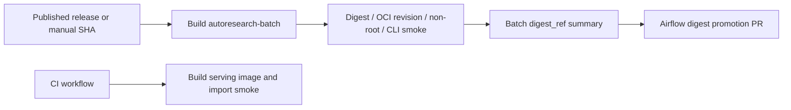
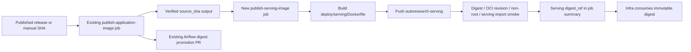

# Serving Image Release Pipeline Design

**Date:** 2026-07-23  
**Issue:** [SKYAHO/Autoresearch#266](https://github.com/SKYAHO/Autoresearch/issues/266)  
**Status:** Approved for implementation  
**Scope:** Autoresearch application repository only

## 1. Problem

`deploy/serving/Dockerfile` is already built and import-smoked by CI, but the
release workflow publishes only `autoresearch-batch`. The infra repository
therefore has no immutable serving image reference to deploy. A serving image
must be built from the exact release source, pushed to GAR, verified, and
reported as a digest reference without changing the existing batch release
and Airflow promotion path.

## 2. Goals

- Publish `autoresearch-serving` from the existing `.github/workflows/release.yml`.
- Build from `deploy/serving/Dockerfile` with the checked-out full commit SHA as
  `VCS_REF`.
- Make the image prove its source identity through
  `org.opencontainers.image.revision`.
- Verify the pushed digest, non-root runtime user, and a serving-specific
  import smoke before reporting success.
- Write an immutable `digest_ref` to the GitHub Actions job summary for the
  infra repository to consume.
- Preserve the existing batch image build, verification, and Airflow digest
  promotion behavior.
- Keep WIF, IAM, Secret Manager, Redis, and GKE deployment changes out of this
  application repository issue.

## 3. Non-goals

- Deploying a serving Deployment or Service to GKE.
- Changing Workload Identity Federation, IAM bindings, Redis TLS, or Secret
  Manager configuration.
- Starting a real model/Feast/Redis-backed HTTP server in the release runner.
- Changing the `/rerank` API or the serving feature contract.
- Creating a second release workflow.

## 4. Current and target flow

### As-is



### To-be



The serving job depends on the existing batch job only to consume its already
verified `source_sha`. It does not consume the batch image digest and does not
change the batch job's outputs or verification steps. This avoids a second
source-resolution implementation while guaranteeing that both images are
built from the same commit.

## 5. Design

### 5.1 Release workflow

Add a `publish-serving-image` job to the existing
`.github/workflows/release.yml`:

1. Depend on `publish-application-image` and read
   `needs.publish-application-image.outputs.source_sha`.
2. Checkout that exact SHA with `fetch-depth: 1`.
3. Reuse the existing release configuration variables and WIF/GAR
   authentication contract.
4. Resolve the image URI as:
   `\`${GCP_REGION}-docker.pkg.dev/${GCP_PROJECT_ID}/${GAR_REPOSITORY}/autoresearch-serving\``.
5. Push an immutable SHA tag, `sha-${SOURCE_SHA}`, and the release tag when
   the event is a published release.
6. Pass `VCS_REF=${SOURCE_SHA}` to `docker/build-push-action@v6` with
   `file: deploy/serving/Dockerfile` and `push: true`.
7. Pull the returned digest reference before verification. Do not validate a
   mutable tag.

The job has `contents: read` and `id-token: write`, matching the existing GAR
push job. No new secret or IAM role is introduced.

### 5.2 Serving Dockerfile metadata

Add the following metadata contract to `deploy/serving/Dockerfile`:

```dockerfile
ARG VCS_REF=unknown
LABEL org.opencontainers.image.revision="${VCS_REF}"
```

The default keeps local builds valid, while the release workflow always passes
the full checked-out commit SHA. The existing `USER appuser` remains the
runtime security boundary.

### 5.3 Release verification

The serving verification step runs against `IMAGE_URI@DIGEST` and fails closed
when any condition is false:

- Build output matches `^sha256:[0-9a-f]{64}$`.
- Pulled image OCI revision equals `SOURCE_SHA`.
- Docker config user is present and is neither `0` nor `root`.
- The serving runtime imports `feast`, `fastapi`,
  `feature_repo.redis_iam`, and `src.serving.app`.

The import smoke intentionally does not start Uvicorn or contact the model,
Feast, Redis, Secret Manager, or MLflow. Those dependencies belong to the
infra deployment and runtime smoke issue.

On success, the verify step exposes:

```text
digest_ref=<GAR serving image>@sha256:<64 hex characters>
```

The job summary must include the same value, together with the source SHA and
immutable tag. This is the handoff consumed by
`SKYAHO/Autoresearch-infra#302`.

### 5.4 Failure and rollback behavior

- A serving build or verification failure fails `publish-serving-image` and
  prevents a false serving digest from being reported.
- Existing batch verification and Airflow promotion remain unchanged.
- Existing GAR digests are immutable rollback candidates.
- GKE rollout and rollback remain infra-owned operations using a previously
  verified serving digest.

## 6. Test and verification contract

Add or extend static contract tests without requiring GCP credentials:

- `tests/test_release_workflow.py` verifies the serving job exists, uses
  `deploy/serving/Dockerfile`, pushes with `VCS_REF`, depends on the batch
  source output, validates the serving import, and writes `digest_ref` to the
  summary.
- `tests/test_serving_deployment.py` verifies `VCS_REF`, the OCI revision
  label, the Feast-compatible dependency group, the copied serving packages,
  and the non-root `USER appuser` contract.

Implementation validation will be:

```text
uv run --frozen --no-sync python -m pytest \
  tests/test_release_workflow.py tests/test_serving_deployment.py -v
uv run --frozen --no-sync python -m pytest -v
git diff --check
```

The actual GAR push and digest verification are performed by the release
workflow after the PR is merged or manually dispatched with a valid source
SHA. No real GCP resource is created by this application change.

## 7. Documentation and ownership boundary

Update `docs/guides/release-pipeline.md` to document:

- the two published image names;
- the serving image Dockerfile;
- the OCI revision/non-root/import gates;
- the summary `digest_ref` handoff;
- the infra repository as the owner of Deployment/Service rollout and runtime
  connectivity validation.

The application repository owns source, Dockerfile, image build, and image
verification. The infra repository owns GKE manifests, service exposure,
runtime IAM/Secret Manager wiring, and rollout. The two repositories meet at
the immutable serving image digest.

## 8. Implementation sequence

1. Add OCI source metadata to `deploy/serving/Dockerfile`.
2. Add serving release contract assertions to the existing test files.
3. Add the serving release job and summary output to `release.yml`.
4. Update the release pipeline guide.
5. Run the targeted tests and repository validation listed above.
6. Commit the implementation separately from this design document.

## 9. Acceptance criteria

- A published release can build and push `autoresearch-serving` from
  `deploy/serving/Dockerfile`.
- The release output contains a valid serving `digest_ref` with a `sha256:`
  digest.
- The pulled digest image reports the checked-out source SHA in
  `org.opencontainers.image.revision`.
- The image runs as `appuser` and passes the serving import smoke.
- Existing batch image release and Airflow promotion behavior remains
  unchanged.
- No infra WIF, IAM, Redis, or GKE changes are included.
