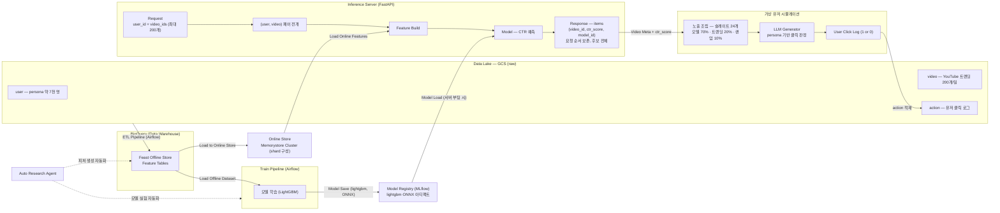

# 전체 파이프라인 개요

> Last Updated: 2026-07-24

팀이 공유하는 전체 파이프라인 아키텍처 그림을 mermaid로 정리한 가이드입니다.
배치(ETL·학습) → 서빙(추론) → 가상 유저 시뮬레이션이 다시 데이터 레이크로
돌아오는 일일 폐루프 전체를 담습니다.

## 아키텍처 다이어그램



## 구간별 상세

### 노출(action) 구성

action log의 노출 슬레이트는 세 소스를 섞어 만듭니다:

| 소스 | 비율 | 결정 방식 |
|---|---|---|
| 유저 관심 카테고리 | 70% | 모델 예측 대상 |
| 트렌딩 | 20% | 알고리즘 (정적으로 결정) |
| 랜덤 | 10% | 말 그대로 랜덤 (정적으로 결정) |

### 서빙 요청·응답

요청은 유저 1명과 후보 영상 최대 200개(중복 금지, 비어 있지 않은 문자열
ID)를 받습니다. 계약 정본은
`docs/specs/2026-07-16-reranking-serving-api.md`와
`src/serving/schemas.py`입니다:

```json
{
  "user_id": "user-1",
  "video_ids": ["video-1", "video-2", "video-3", "...", "video-200"]
}
```

서버는 `(user_id, video_id)` 페어로 전개한 뒤, Online Store에서 온라인
피처를 조회해 Feature Build를 수행합니다. 조립된 피처 행 예시:

```
(user-1, 7일간 유저 시청 시간, ..., video-1, 비디오 좋아요 여부, ...)
(user-1, 100시간, video-1, 1)
(user-1, 100시간, video-2, 0)
...
(user-1, 100시간, video-200, 1)
```

> **참고:** user_id·video_id는 조인 키일 뿐 예측에 의미가 없으므로, 실제
> 모델 입력에서는 제외합니다.

모델이 페어별 CTR을 예측하고, 서버는 **요청 `video_ids` 순서를 보존한 채
후보 전체**를 반환합니다 (top-K 절단 없음, `src/serving/app.py`):

```json
{
  "items": [
    {"video_id": "video-1", "ctr_score": 0.53, "model_id": "run-abc123"},
    {"video_id": "video-2", "ctr_score": 0.12, "model_id": "run-abc123"},
    {"video_id": "...", "ctr_score": 0.0, "model_id": "..."}
  ]
}
```

원본 그림의 "PostProcess (top K)"에 해당하는 **24개 슬레이트 선별은 서버가
아니라 노출 조립 단계**(`src/pipeline/model_exposure_provider.py`,
`candidates_per_user=24`, 모델 0.7 · 트렌딩 0.2 · 랜덤 0.1)에서 수행합니다.

### 가상 유저 클릭 판정 (폐루프의 귀환 구간)

응답의 Video Meta + CTR를 받아, 해당 `user_id`의 persona로 LLM을 호출해
"24개 중 어떤 것을 누를 것인가?"를 판정합니다. 1개를 고르거나 아무것도
고르지 않을 수 있으며, 결과를 유저 클릭 로그(1 or 0)로 저장해 Data Lake의
action으로 적재합니다 — 이 데이터가 다시 다음 학습 데이터셋이 됩니다.

### 자동화 구간

Auto Research Agent가 두 구간을 자동화합니다:

- **피처 생성 자동화** — Feature Table 생성·갱신
- **모델 실험 자동화** — Train Pipeline 실험 반복

## 원본 그림과 저장소 현행 표기의 차이

- **PostProcess(top-K) 위치:** 원본 그림은 추론 서버 안에 PostProcess
  (top K)를 그렸으나, 현행 구현의 `/rerank`는 요청 순서를 보존한 채 후보
  전체를 반환하고(`src/serving/app.py`), 24개 슬레이트 선별은 노출 조립
  (`src/pipeline/model_exposure_provider.py`)에서 수행합니다. 이 문서의
  다이어그램은 현행 구현 기준으로 그렸습니다.
- **Online Store 엔진:** 원본 그림은 Valkey Cluster로 표기하나, 저장소
  spec(`docs/specs/2026-07-15-feast-redis-online-store.md`)과 구현
  (`feature_repo/redis_iam.py`)은 Memorystore Redis Cluster 기준입니다.
  다이어그램에는 중립적으로 "Memorystore Cluster"로 표기했습니다 — 실제
  엔진 표기는 팀 확인 후 통일이 필요합니다.
- **ONNX 아티팩트:** 모델 저장의 ONNX 전환은 진행 중입니다(#302). 현행
  구현은 lightgbm(joblib) 아티팩트입니다.

## 관련 문서

- 리랭킹 서빙 API 계약: `docs/specs/2026-07-16-reranking-serving-api.md`
- 공개 batch 실행 계약: `docs/specs/2026-07-13-public-batch-execution-contract.md`
- CTR 모델 명세: `docs/guides/ctr-model-specification.md`
- 피처 스토어: `docs/guides/feature-store.md`
