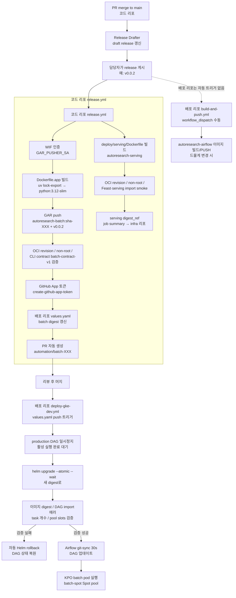

# Release & 배포 파이프라인

PR merge부터 GKE 배포·Airflow 실행까지의 자동화 흐름을 설명합니다. 3개 저장소
(코드·배포·인프라)가 협업하는 구조와 각 워크플로우의 역할을 다룹니다.

## 개요

이 파이프라인은 다음 목표를 달성합니다.

- 코드 변경이 main에 merge되면 Release Drafter가 draft release에 누적
- 담당자가 release를 게시하면 semantic version git tag 생성 및 Docker 이미지 빌드 트리거
- 빌드된 batch·serving 이미지를 Google Artifact Registry(GAR)에 push하고 OCI 메타데이터·실행 계약 검증
- batch 이미지 digest를 배포 리포 values에 자동 반영하는 승격 PR 생성
- serving 이미지 digest를 인프라 리포가 GKE 배포에 소비할 수 있도록 job summary에 기록
- 승격 PR merge 시 GKE에 안전하게 배포 (DAG 일시정지 → helm upgrade → 검증 → 자동 롤백)
- 비용 민감한 batch workload는 Spot node pool로 격리

수동 `gcloud builds submit` 기반의 기존 빌드 과정을 GitHub Actions 기반 자동화로
대체한 구조입니다.

## 전체 아키텍처



## 구성 요소

### Release Drafter (버전 관리)

PR에 붙은 라벨을 기반으로 semantic version을 자동 계산하여 draft release에
변경 이력을 누적합니다.

| 파일 | 역할 |
|------|------|
| `.github/release-drafter.yml` | 라벨 → semver 매핑 규칙. `feature`/`enhancement` → minor, `bug` → patch, `breaking` → major |
| `.github/workflows/release-drafter.yml` | push to main 트리거, `release-drafter@v7` 실행 |

**동작 방식**:

1. PR이 main에 merge되면 release-drafter 워크플로우 실행
2. 라벨 기반으로 다음 버전 계산 (예: `feature` 라벨 → minor 증가)
3. draft release 갱신 (변경 이력 누적)
4. 담당자가 "Publish release" 버튼 클릭 → git tag 생성 (예: `v0.0.2`)
5. 코드 리포에서는 publish 시 `.github/workflows/release.yml` 트리거 (이미지 빌드 시작)

버전 기준점은 v0.0.1입니다. 양쪽 저장소(코드·배포)에 각각 독립적으로
존재하며, 배포 리포의 release는 배포 인프라 변경 이력 추적용입니다.

### 애플리케이션 이미지 빌드 및 GAR push (release.yml)

코드 리포의 `release.yml`은 release가 게시되면 batch와 serving 이미지를 각각
빌드하여 GAR에 push합니다. serving job은 batch job이 검증한 동일한
`source_sha`를 checkout하므로 두 이미지의 소스 계보가 일치합니다.

**주요 단계**:

1. **WIF 인증**: `GAR_PUSHER_SA` secret을 사용해 GCP Workload Identity Federation으로
   인증. 서비스 계정 키 없이 GitHub Actions에서 GCP 접근.
2. **이미지 빌드**: `Dockerfile.app` (multi-stage, uv lock-export → python:3.12-slim,
   non-root user). 빌드 인자로 `VCS_REF`(commit SHA) 전달.
3. **GAR push**: `autoresearch-batch:sha-<short>` + release tag (예: `v0.0.2`) 두 개 태그로 push.
4. **검증**: OCI revision 라벨, non-root 실행, CLI 계약(batch-contract-v1) 6개 모듈
   import 확인 (youtube_trending, youtube_backfill, action_log, action_log_quality,
   feature_store_build, daily_recommendations).
5. **Digest 승격 PR**: GitHub App 토큰으로 배포 리포에 PR 자동 생성 (아래 참조).

workflow_dispatch(`source_sha` 입력)로 수동 실행도 가능합니다.

#### Serving 이미지 release job

`publish-serving-image` job은 다음 계약으로
`autoresearch-serving`을 발행합니다.

1. `deploy/serving/Dockerfile`을 사용하고 `VCS_REF`에 full commit SHA를 전달
2. `sha-<full-sha>` immutable tag와 published release tag를 GAR에 push
3. push 결과 digest를 pull하여 `org.opencontainers.image.revision`이 source SHA와 같은지 확인
4. 이미지가 non-root `appuser`로 실행되는지 확인
5. `lightgbm`, `feast`, `fastapi`, `feature_repo.redis_iam`, `src.serving.app` import smoke 실행
6. 검증된 `IMAGE_URI@sha256:<digest>`를 `Serving digest_ref`로 GitHub job summary에 기록

이 단계는 실제 모델, Redis, Secret Manager, GKE endpoint에 접속하지 않습니다.
실제 serving Deployment/Service rollout과 runtime connectivity 검증은
`SKYAHO/Autoresearch-infra`가 소유합니다.

### Digest 승격 PR 자동화

release.yml의 두 번째 job은 빌드된 batch 이미지의 digest를 배포 리포
`deploy/airflow/values.yaml`에 반영하는 PR을 자동 생성합니다.

1. GitHub App(`Autoresearch CI Dispatcher`) 토큰 생성
2. 배포 리포 checkout
3. `scripts/promote_batch_image.py`로 `values.yaml`의 batch digest 갱신
4. `peter-evans/create-pull-request@v8`로 PR 생성 (브랜치명: `automation/batch-<short_sha>`)

이 PR은 사람이 리뷰한 뒤 머지하면 deploy-gke-dev.yml이 트리거됩니다.

### GKE 배포 및 검증 (deploy-gke-dev.yml)

배포 리포의 `deploy-gke-dev.yml`은 `values.yaml` 변경 시 GKE에 안전하게
배포합니다. 단순한 helm upgrade가 아니라 production DAG 안전성을 보장하는
정교한 검증 파이프라인입니다.

1. **사전 검증**: `values.yaml`의 digest 형식 검증 (`promote_batch_image.py --check`)
2. **DAG 일시정지**: `youtube_gcs_action_log_pipeline` 일시정지 후 활성 실행 완료까지 대기 (최대 300분)
3. **Helm upgrade**: `--atomic --wait --wait-for-jobs --timeout 15m` (실패 시 자동 롤백 내장)
4. **배포 후 검증**:
   - scheduler/webserver rollout 완료 대기
   - 배포된 `AUTORESEARCH_BATCH_IMAGE` 변수값 = `values.yaml` digest 일치 확인
   - DAG import 에러 0건 확인
   - production DAG task 8개 존재 확인 (`collect` + `shard_001~005` + `merge` + `validate`)
   - `action_log_openrouter` pool slots = 2 확인
5. **실패 시 자동 롤백**: 검증 실패하면 이전 Helm revision으로 rollback 후 production DAG 상태 복원
6. **항상 DAG 상태 복원**: 성공/실패 무관하게 원래 pause/unpause 상태로 복원

### Airflow 이미지 빌드 (build-and-push.yml)

배포 리포의 `build-and-push.yml`은 Airflow 런타임 이미지를 빌드합니다.
`docker/airflow/Dockerfile`(`quay.io/astronomer/astro-runtime:13.8.0` 베이스)을
사용하며, workflow_dispatch(`image_tag` 입력)로 수동 실행합니다.

Airflow 이미지는 astro-runtime 베이스가 거의 변하지 않으므로 자주 빌드하지
않습니다. DAG는 git-sync으로 실시간 동기화되므로 이미지 재빌드와 무관합니다.

### Spot node pool (비용 최적화)

batch workload는 GKE Spot node pool(`batch-spot`)에서 실행되어 비용을
60~90% 절감합니다. min 0 autoscaling으로 KPO가 없을 때 노드가 0대가 됩니다.

**인프라** (infra 리포): `batch-spot` node pool (spot=true, e2-standard-2,
min 0/max 2), taint `workload=batch-spot:NoSchedule`, DaemonSet toleration.

**애플리케이션** (배포 리포 DAG): KPO에 `nodeSelector`
(`cloud.google.com/gke-nodepool: batch-spot`) + `tolerations` 추가.
Spot VM 회수에 대비해 `retries >= 1` 유지.

## 3개 저장소 책임 경계

| 저장소 | 역할 | 주요 워크플로우 |
|--------|------|----------------|
| **`SKYAHO/Autoresearch`** | 코드 + 애플리케이션 이미지 빌드/GAR push + digest 승격 PR 자동화 | `release.yml`, `release-drafter.yml`, `ci.yml`, `lint.yml` |
| **`SKYAHO/Autoresearch-airflow`** | Airflow 이미지 빌드(수동) + Helm 배포 + DAG | `build-and-push.yml`, `deploy-gke-dev.yml`, `helm-lint.yml`, `release-drafter.yml` |
| **`SKYAHO/Autoresearch-infra`** | Terraform IaC (GKE, GAR, WIF, SA, IAM) | Terraform plan/apply (GitHub Actions CI + 수동 apply) |

자세한 책임 경계와 허용 의존 방향은 [ADR 0002](../adr/0002-repository-responsibility-boundaries.md)를
참조하세요.

## 운영

### 새 release 게시 (이미지 배포)

1. PR에 적절한 라벨 부여 (`feature`/`enhancement`/`bug`/`breaking`)
2. PR을 main에 merge → Release Drafter가 draft release 갱신
3. GitHub Releases에서 draft release 게시 (Publish release)
4. release.yml이 자동 실행: batch·serving 이미지 빌드 → GAR push → batch digest 승격 PR 생성 및 serving digest summary 기록
5. batch 승격 PR 리뷰 후 머지 → deploy-gke-dev.yml이 자동 실행: GKE 배포 + 검증
6. infra serving 배포는 release summary의 serving `digest_ref`를 사용

### 수동으로 이미지 빌드 (긴급 수정)

코드 리포 release.yml의 workflow_dispatch(`source_sha`)로 특정 커밋의 이미지를
빌드할 수 있습니다. release 게시 없이 이미지만 push해야 할 때 사용합니다.

### 이미지 확인

```bash
# GAR의 batch 이미지 목록
gcloud artifacts docker images list \
  asia-northeast3-docker.pkg.dev/ar-infra-501607/autoresearch-dev-docker/autoresearch-batch

# 특정 태그의 digest
gcloud artifacts docker images describe \
  asia-northeast3-docker.pkg.dev/ar-infra-501607/autoresearch-dev-docker/autoresearch-batch:v0.0.2

# serving 이미지 목록
gcloud artifacts docker images list \
  asia-northeast3-docker.pkg.dev/ar-infra-501607/autoresearch-dev-docker/autoresearch-serving
```

## 워크플로우 파일 참조

### 코드 리포 (`SKYAHO/Autoresearch`)

| 파일 | 역할 |
|------|------|
| `.github/release-drafter.yml` | 라벨 → semver 매핑 규칙 |
| `.github/workflows/release-drafter.yml` | push to main 트리거 |
| `.github/workflows/release.yml` | release:published → batch·serving 빌드/GAR push/digest 승격 PR |
| `Dockerfile.app` | multi-stage batch 이미지 (uv lock-export → python:3.12-slim, non-root) |
| `deploy/serving/Dockerfile` | Feast 호환 serving 이미지 (FastAPI/Uvicorn, non-root) |

### 배포 리포 (`SKYAHO/Autoresearch-airflow`)

| 파일 | 역할 |
|------|------|
| `.github/workflows/build-and-push.yml` | airflow 이미지 수동 빌드 (workflow_dispatch) |
| `.github/workflows/deploy-gke-dev.yml` | digest 승격 PR 머지 시 GKE 배포 자동화 |
| `deploy/airflow/` | ArgoCD umbrella chart (Chart.yaml, values.yaml, values.example.yaml) |
| `scripts/promote_batch_image.py` | values.yaml의 batch digest 갱신 스크립트 |
| `dags/youtube_gcs_action_log_pipeline_factory.py` | KPO batch DAG (Spot pool 적용) |
| `dags/youtube_backfill_kr.py` | YouTube backfill DAG (Spot pool 적용) |

### 인프라 리포 (`SKYAHO/Autoresearch-infra`)

| 파일 | 역할 |
|------|------|
| `terraform/bootstrap/main.tf` | WIF pool, attribute_condition (list 멤버십) |
| `terraform/envs/dev/github_actions.tf` | GAR push용 SA + WIF IAM + GAR writer 권한 |
| `terraform/envs/dev/*.tf` | batch-spot node pool 정의 포함 |

serving 이미지의 실제 GKE Deployment/Service, Workload Identity·Secret
Manager 연결, Redis TLS runtime 검증은 `SKYAHO/Autoresearch-infra#302`의
책임 범위입니다. 이 저장소는 검증된 immutable image digest를 발행하는
지점까지를 담당합니다.
