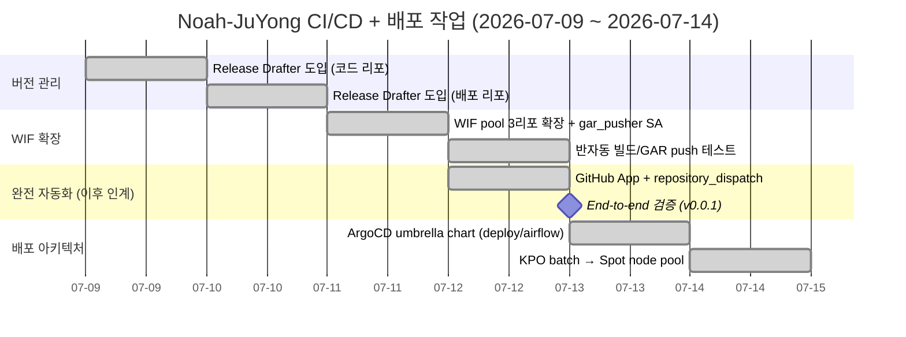
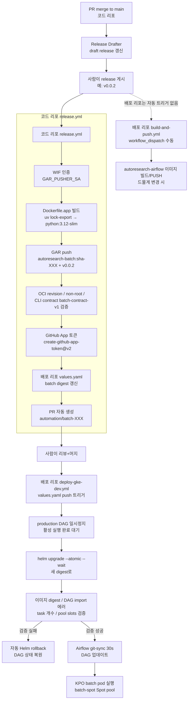

# Release & 배포 파이프라인 (Noah-JuYong 기여 정리)

> **대상**: 팀원 전원. CI/CD와 배포 파이프라인 중 Noah-JuYong이 구축한 부분과 현재 아키텍처까지의 흐름을 공유합니다.
>
> **도메인**: YouTube Collection & Release (`autoresearch/youtube_collection/`, `proxy/`, `.github/workflows/`)

## 목표

- PR merge → 사람의 release 게시 한 번 → Docker 이미지 빌드·검증·GAR push → digest 승격 PR → GKE 배포 → Airflow 실행까지 자동화
- 수동 `gcloud builds submit`을 GitHub Actions 기반으로 대체
- 비용 민감한 batch workload를 Spot node pool로 격리

## 기여 타임라인



## 작업별 상세

### 1. Release Drafter 도입 (Phase 1 — 버전 관리)

**목적**: PR merge → draft release 자동 누적 → 사람이 publish하면 semantic version git tag 생성.

**도입 배경**: 기존에는 태그 없이 수동 `gcloud builds submit --substitutions _IMAGE_TAG=manual`로 빌드. 어떤 커밋이 어떤 이미지인지 추적 불가.

**산출물** (양쪽 리포 동일 구조):

| 파일 | 리포 | 역할 |
|------|------|------|
| `.github/release-drafter.yml` | 코드, 배포 | 라벨 → semver 매핑 규칙 (`feature/enhancement=minor`, `bug=patch`, `breaking=major`) |
| `.github/workflows/release-drafter.yml` | 코드, 배포 | push to main 트리거, `release-drafter@v7` |

**동작 방식**:
1. PR이 main에 merge되면 release-drafter 워크플로우 실행
2. 라벨 기반으로 다음 버전 계산 (예: `feature` 라벨 → minor 증가)
3. draft release 갱신 (누적)
4. 담당자가 "Publish release" 버튼 클릭 → git tag 생성 (예: `v0.0.2`)
5. **코드 리포에서만**: publish 시 `.github/workflows/release.yml` 트리거 (Docker 빌드 자동 시작)

**버전 기준점**: v0.0.1 (Release Drafter default v1.0.0에서 명시적 하향 설정)

**관련 PR**: 코드 PR #106 (Closes #103), 배포 PR #16 (Closes #15)

---

### 2. WIF pool 확장 + 반자동 빌드 (Phase 2)

**목적**: GitHub Actions가 GCP에 키 없이 인증 (Workload Identity Federation)하여 GAR에 push.

**문제**: 기존 WIF pool의 `attribute_condition`이 `attribute.repository == "SKYAHO/Autoresearch-infra"` 단일 리포만 허용. 배포 리포 GitHub Actions가 GCP 인증 불가.

**해결** (infra 리포, PR #128):

1. **bootstrap/main.tf**: `attribute_condition`을 list 멤버십으로 확장
   ```hcl
   attribute_condition = "attribute.repository in ${jsonencode(var.allowed_github_repositories)}"
   ```
2. **envs/dev/github_actions.tf** 신규: `gar_pusher` SA + WIF 가장(IAM) + GAR writer 권한
   - `principalSet://iam.googleapis.com/<pool>/attribute.repository/SKYAHO/Autoresearch-airflow` → `gar_pusher` SA
   - `roles/artifactregistry.writer` 부여
3. **default 보수적 유지**: `allowed_github_repositories` default는 infra 리포만. tfvars로 opt-in.

**반자동 빌드 테스트** (배포 리포 `build-and-push.yml` workflow_dispatch):
- `autoresearch_ref=1b091c8`, `image_tag=phase2-test` 입력
- WIF 인증 → batch 빌드 → airflow 빌드 → GAR push (3분 8초 소요, 성공)
- GAR에 batch + airflow 이미지(`phase2-test` tag) 확인

**관련 PR**: infra PR #128 (Closes #121). 이후 bbungjun이 infra PR #158에서 코드 리포용 `app-pusher` SA를 별도 추가 (역할 분리).

---

### 3. 완전 자동화 (Phase 3 — 이후 bbungjun이 단순화)

**목적**: release 게시 한 번으로 cross-repo 자동 빌드 트리거.

**도입 구조** (GitHub App + repository_dispatch):
```text
코드 리포 release:published
  → actions/create-github-app-token@v3
  → POST /repos/SKYAHO/Autoresearch-airflow/dispatches
    event_type: autoresearch-released
    client_payload: { ref, tag }
  → 배포 리포 build-and-push.yml (repository_dispatch 트리거)
    → WIF 인증 → batch + airflow 빌드 → GAR push
```

**GitHub App**: `Autoresearch CI Dispatcher` (App ID 4280269, org 소유, 배포 리포에만 install)
- 권한: Contents R/W, Metadata R/W
- Secrets: `APP_ID`, `APP_PRIVATE_KEY` (코드 리포)

**보안 리뷰 반영** (PR #123):
- JSON payload를 `jq -nc --arg`로 안전 생성 (인젝션 방지)
- `${{ }}` 직접 보간 대신 `env:`로 전달 (스크립트 인젝션 방지)

**End-to-end 검증** (v0.0.1):
- 코드 리포 release v0.0.1 게시 → release.yml (10초) → repository_dispatch 전송
- 배포 리포 build-and-push.yml (3분 6초) → batch + airflow GAR push
- GAR에 `v0.0.1` tag 이미지 확인

**관련 PR**: 코드 PR #123 (Closes #122), 배포 PR #36 (Closes #35)

> **참고 — bbungjun 아키텍처 단순화**: 이후 bbungjun이 cross-repo dispatch를 제거하고 코드 리포가 직접 WIF로 GAR push + digest 승격 PR 자동화를 하는 구조로 재설계 (PR #135, #146). GitHub App은 digest 승격 PR 용도로만 계속 사용 (액션은 @v3 → @v2로 변경, 둘 다 활성 라인). 현재 파이프라인은 다음 섹션 참조.

---

### 4. ArgoCD umbrella chart (배포 아키텍처)

**목적**: 분산된 chart/values를 단일 경로로 통합하여 ArgoCD Application source로 사용 가능하게.

**이전**:
```text
charts/autoresearch-airflow/   ← chart 정의
helm/values-gke-dev.yaml       ← dev 배포 values (분리됨)
helm/values-dev.yaml           ← 예제 values
environments/gke-values.example.yaml  ← 중복
```

ArgoCD Application은 단일 `source.path`만 지정 가능한데 chart와 values가 분리되어 있어 사용 불가.

**이후** (`deploy/airflow/`로 통합):
```text
deploy/airflow/
├── Chart.yaml              ← umbrella chart (apache-airflow/airflow 1.16.0 pin)
├── values.yaml             ← 실제 dev 배포 values (구 helm/values-gke-dev.yaml)
└── values.example.yaml     ← 신규 환경 구성용 placeholder
```

**검증**:
- `helm lint deploy/airflow` 통과
- 기존 manifest와 동일성 확인 (2220줄 동일, fernet-key 무작위 값만 차이)
- 기존 경로 참조 잔존 0건 (README, CLAUDE.md, Makefile, CI, 테스트, docs 일괄 갱신)

**관련 PR**: 배포 PR #53 (Closes #17)

---

### 5. KPO batch pod → Spot node pool (비용 최적화)

**목적**: batch workload를 GKE Spot node pool(`batch-spot`)로 전환하여 비용 60~90% 절감. min 0 autoscaling으로 KPO가 없을 때 노드 0대.

**인프라 선행 작업** (hyeongyu-data, infra PR #174):
- `batch-spot` node pool 신설 (spot=true, e2-standard-2, min 0/max 2)
- taint `workload=batch-spot:NoSchedule`
- DaemonSet (filebeat, node-exporter) toleration 추가

**애플리케이션 변경** (배포 PR #56, Closes #52):
- `dags/youtube_gcs_action_log_pipeline_factory.py`: 4개 KPO에 `nodeSelector` + `tolerations` 추가
- `dags/youtube_backfill_kr.py`: 동일 설정 + DAG default `retries` 0→1
- `merge_action_log_partition`, `validate_action_log_partition` retries 0→1 (Spot 회수 내성)

**retries 변경 배경**: 기존 retries=0은 bbungjun의 의도적 설계 (데이터/로직 실패는 재시도 무의미). Spot VM 회수는 인프라 중단이므로 재시도로 복구 가능 → 이슈 #52 명시 요청에 따라 0→1.

## 현재 파이프라인 전체 (bbungjun 인계 후)



### deploy-gke-dev.yml 검증 파이프라인 (bbungjun 설계)

`deploy-gke-dev.yml`은 단순한 helm upgrade가 아니라, production DAG 안전성을 보장하는 정교한 검증 파이프라인입니다:

1. **사전 검증**: `values.yaml`의 digest 형식 검증 (`promote_batch_image.py --check`)
2. **DAG 일시정지**: `youtube_gcs_action_log_pipeline` 일시정지 후 활성 실행 완료까지 대기 (최대 300분)
3. **Helm upgrade**: `--atomic --wait --wait-for-jobs --timeout 15m` (실패 시 자동 롤백 내장)
4. **배포 후 검증**:
   - scheduler/webserver rollout 완료 대기
   - 배포된 `AUTORESEARCH_BATCH_IMAGE` 변수값 = `values.yaml` digest 일치 확인
   - DAG import 에러 0건 확인
   - production DAG task 8개 존재 확인 (`collect` + `shard_001~005` + `merge` + `validate`)
   - `action_log_openrouter` pool slots = 2 확인
5. **실패 시 자동 롤백**: 검증 실패하면 이전 Helm revision으로 rollback 후 production DAG 상태 복원
6. **항상 DAG 상태 복원**: 성공/실패 무관하게 원래 pause/unpause 상태로 복원

### 3개 리포 책임 경계

| 리포 | 역할 | 주요 워크플로우 |
|------|------|----------------|
| **`SKYAHO/Autoresearch`** | 코드 + 애플리케이션 이미지 빌드/GAR push + digest 승격 PR 자동화 | `release.yml`, `release-drafter.yml`, `ci.yml`, `lint.yml` |
| **`SKYAHO/Autoresearch-airflow`** | Airflow 이미지 빌드(수동) + Helm 배포 + DAG | `build-and-push.yml`, `deploy-gke-dev.yml`, `helm-lint.yml`, `release-drafter.yml` |
| **`SKYAHO/Autoresearch-infra`** | Terraform IaC (GKE, GAR, WIF, SA, IAM) | Terraform plan/apply (GitHub Actions CI + 수동 apply) |

## 기여 요약

| 작업 | Noah-JuYong PR | 현재 상태 |
|------|---------------|----------|
| Release Drafter (코드 리포) | 코드 #106 | ✅ 운영 중 |
| Release Drafter (배포 리포) | 배포 #16 | ✅ 운영 중 |
| WIF pool 3리포 확장 + gar_pusher SA | infra #128 | ✅ 운영 중 (배포 리포 airflow 빌드에 사용) |
| Phase 3 GitHub App + dispatch | 코드 #123, 배포 #36 | ⚠️ bbungjun이 더 단순한 구조로 교체 (PR #135). GitHub App은 digest 승격 PR 용도로 계속 사용 |
| ArgoCD umbrella chart (deploy/airflow) | 배포 #53 | ✅ 운영 중 (ArgoCD Application source) |
| KPO batch → batch-spot Spot pool | 배포 #56 | ✅ 운영 중 (비용 60-90% 절감) |

## 관련 파일

### 코드 리포 (`SKYAHO/Autoresearch`)
- `.github/release-drafter.yml` — 라벨 → semver 매핑 규칙
- `.github/workflows/release-drafter.yml` — push to main 트리거
- `.github/workflows/release.yml` — release:published → 빌드/GAR push/digest 승격 PR 자동화 (현재 bbungjun 버전)
- `Dockerfile.app` — multi-stage batch 이미지 (uv lock-export → python:3.12-slim, non-root)

### 배포 리포 (`SKYAHO/Autoresearch-airflow`)
- `.github/release-drafter.yml`, `.github/workflows/release-drafter.yml`
- `.github/workflows/build-and-push.yml` — airflow 이미지 수동 빌드 (workflow_dispatch)
- `.github/workflows/deploy-gke-dev.yml` — digest 승격 PR 머지 시 GKE 배포 자동화
- `deploy/airflow/` — ArgoCD umbrella chart (Chart.yaml, values.yaml, values.example.yaml)
- `scripts/promote_batch_image.py` — values.yaml의 batch digest 갱신 스크립트
- `dags/youtube_gcs_action_log_pipeline_factory.py` — KPO batch DAG (Spot pool 적용)
- `dags/youtube_backfill_kr.py` — YouTube backfill DAG (Spot pool 적용)

### 인프라 리포 (`SKYAHO/Autoresearch-infra`)
- `terraform/bootstrap/main.tf` — WIF pool, attribute_condition (list 멤버십)
- `terraform/envs/dev/github_actions.tf` — gar_pusher SA + WIF IAM + GAR writer
- `terraform/envs/dev/outputs.tf` — `github_actions_gar_pusher_service_account_email` output
- Spot node pool 정의 (batch-spot)

## 레퍼런스

- 멘토 회의 요청사항 6개 (Release Drafter, GAR push 자동화, Airflow Variable, Docker 분리, Sensor, MLflow) — 본문의 CI/CD+배포 영역 전부 완료
- 멘토 추가 요청: "신규 개발 줄이고 전체 구조 정리" — 본 문서가 그 일환
- bbungjun 인계 이후: 현재 release.yml, build-and-push.yml, deploy-gke-dev.yml의 실제 동작은 bbungjun이 재설계한 버전. 이 문서의 Phase 1-3 역사는 초기 구축 과정 기록
