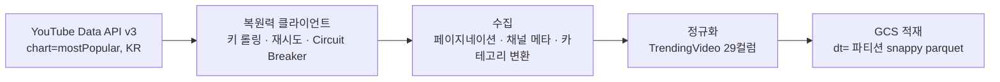
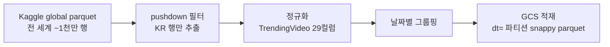

# YouTube 트렌딩 수집 파이프라인

한국(KR) YouTube 트렌딩 영상을 YouTube Data API v3로 수집하여 GCS Data Lake에
적재하는 파이프라인을 설명합니다. 일일 수집과 과거 데이터 일괄 적재(backfill)
두 경로를 다루며, BigQuery 적재 이후는 이 문서의 범위에서 제외합니다.

## 개요

이 파이프라인은 다음 목표를 달성합니다.

- 한국 인기 급상승(chart=mostPopular) 영상 ~200개를 매일 수집
- 영상 메타 + 채널 메타 + 카테고리명을 결합한 단일 정규 스키마로 변환
- GCS에 hive 파티션(`dt=YYYY-MM-DD`) parquet 파일로 적재
- 동일 스키마로 Kaggle 과거 데이터를 일괄 적재(backfill)
- 재실행 안전(멱등): 같은 날짜 파티션은 덮어쓰기

## 데이터 흐름

### 일일 수집



### 과거 데이터 일괄 적재 (backfill)



## 데이터 계약 (TrendingVideo)

모든 원본이 `TrendingVideo` 모델(pydantic BaseModel, 29컬럼)로 정규화된 뒤
Data Lake에 적재됩니다. 원본 출처가 무엇이든 이 스키마만 맞으면 됩니다.

| 그룹 | 필드 | 타입 | 비고 |
|------|------|------|------|
| 영상 식별 | `video_id` | `str` | |
| 영상 메타 | `video_published_at`, `video_trending_date` | `datetime` | |
| | `video_trending_country` | `str` | 항상 "KR" |
| | `video_title`, `video_description` | `str` | |
| | `video_default_thumbnail` | `str` | |
| | `video_category` | `str` | 카테고리 이름("Music"), 숫자 id 아님 |
| | `video_tags` | `list[str]` | |
| | `video_duration`, `video_dimension`, `video_definition` | `str` | |
| | `video_licensed_content` | `bool` | |
| 영상 통계 | `video_view_count`, `video_like_count`, `video_comment_count` | `int` (≥0) | 누적 스냅샷 |
| 채널 메타 | `channel_id`, `channel_title`, `channel_description` | `str` | |
| | `channel_custom_url` | `str` | |
| | `channel_published_at` | `datetime \| None` | 원본 일부 결측 |
| | `channel_country` | `str` | |
| 채널 통계 | `channel_view_count`, `channel_video_count` | `int` (≥0) | |
| | `channel_subscriber_count` | `int \| None` (≥0) | 구독자 숨김 시 null |
| | `channel_have_hidden_subscribers` | `bool` | 숨김 여부 |
| | `channel_localized_title`, `channel_localized_description` | `str` | |
| 수집 메타 | `collected_at` | `datetime` | 수집 시각 (freshness 신호) |

> 같은 영상이 여러 날 트렌딩에 머물면 매일 별도 행으로 들어옵니다. 카운트는
> 그날의 누적값이므로 중복 제거(dedupe) 금지 — 일자별 델타가 피처의 원천입니다.

스키마 버전: `youtube_trending_kr_v1` (`schema.py`의 `SCHEMA_VERSION`)

## 수집 모듈

### 복원력 클라이언트 (`client.py`)

`ResilientYouTubeClient`는 API 호출에 계층적 복원력을 적용합니다.

```
재시도(tenacity) → API 키 롤링(keyInvalid/401) → IP밴 시그니처 감지 → Circuit Breaker
```

- **재시도**: 429/5xx, rateLimit, 네트워크 예외에 대해 지수 백오프
- **키 롤링**: `keyInvalid`, `keyExpired`, 401 등 키 무효 시 다음 키로 회전
- **IP밴 시그니처**: 전 키 동일 403 → IP밴 후보로 분류, proxy 경로로 전환
- **Circuit Breaker**: 연속 실패 시 해당 키를 skip하고 알림

`make_callables()`는 fetch 모듈이 요구하는 callable 형식(`list_videos(**kw) -> dict`)을
반환합니다. 이 **callable 주입 패턴** 덕분에 핵심 수집 로직이 googleapiclient에
의존하지 않아, 순수 dict로 단위 테스트가 가능합니다.

> IP밴 대응 proxy 계층은 학습/포트폴리오 목적입니다. 정상 환경에서 IP밴은
> 꼬리 케이스입니다. 자세한 근거는 [ADR 0001](../adr/0001-youtube-proxy-purpose.md)을
> 참조하세요.

### 수집 로직 (`fetch.py`)

`collect_trending()`이 진입점입니다. 내부 흐름:

1. **트렌딩 영상 수집**: `chart=mostPopular`, `regionCode=KR`, 50개/페이지로
   페이지네이션하여 max_results(기본 200)개까지 수집
2. **카테고리 맵 생성**: `videoCategories.list`로 `{categoryId: "이름"}` 맵 구성
3. **채널 메타 배치 조회**: 고유 channelId를 50개씩 배치로 `channels.list` 조회
4. **정규화**: 각 영상을 채널 메타와 카테고리명을 결합하여 `TrendingVideo`로 변환

쿼터 사용량: `videos.list` 1 unit × 4페이지 + `channels.list` 1 unit × 3배치
= 약 **7 units/일** (일일 예산 10,000의 0.07%).

## 변환 모듈 (`transform.py`)

두 종류 원본을 같은 `TrendingVideo` 스키마로 변환합니다.

| 함수 | 원본 | 특징 |
|------|------|------|
| `normalize_api_item()` | YouTube API 응답 1건 | 중첩 구조(snippet/statistics)를 flat dict로 펼침 |
| `normalize_kaggle_row()` | Kaggle parquet 1행 | 모든 컬럼이 string이라 타입 강제 변환 필요 |

두 경로 모두 **동일한 `_coerce` 통로**를 거쳐 타입이 보장됩니다. 타입 힌트를
기준으로 분기합니다:

- `Optional[T]`: 결측/빈값이면 `None`, 아니면 `T`로 재귀
- `str`: 결측이면 빈 문자열
- `int`: `"482000.0"` 같은 float 문자열을 `int`로
- `bool`: `"False"` 문자열과 `True` bool 모두 처리
- `datetime`: Kaggle 점 날짜(`2024.10.12`)를 ISO로 변환, UTC 보장
- `list[str]`: API는 list, Kaggle은 콤마 조인 문자열

**KR-only 강제**: `_normalize_country()`가 KR 외 국가면 `ValueError`로 거부합니다.
잘못된 국가 데이터가 레이크에 섞이는 것을 원천 차단합니다.

## 적재 모듈 (`load.py`)

`write_partition()`이 하루 분량 스냅샷을 단일 snappy parquet 파일로 저장합니다.

### GCS 파티션 레이아웃

```
{base_path}/dt=YYYY-MM-DD/part-0.parquet
```

- `base_path`: `gs://{YOUTUBE_LAKE_BUCKET}/data_lake/youtube_trending_kr` (bucket 상대경로, `gs://` 제외)
- `dt` 키는 hive 파티션 키 — 파일 안에 컬럼으로 저장되지 않지만,
  hive-aware 읽기(`pq.read_table(..., partitioning="hive")`)로 자동 파생
- 하이픈 날짜(`2026-07-16`) 사용 — 슬래시(`2026/07/16`)는 경로 구분자가 되어
  hive 자동 감지가 깨지므로 안티패턴

### 멱등성

같은 `dt`를 다시 쓰면 `part-0.parquet`을 덮어씁니다. 하루에 여러 번 수집해도
안전(마지막 스냅샷이 남음). 재실행/백필 안전성의 핵심입니다.

### 명시적 스키마

pyarrow 스키마를 29컬럼 모두 명시적으로 고정합니다. `from_pylist` 자동 추론
대신 명시적 스키마를 쓰면, 한 파티션의 값이 전부 `None`이어도 `null` 타입이
아닌 `int64`/`timestamp`로 쓰여 파티션 간 스키마 충돌을 원천 차단합니다.

### filesystem 분리

- `None` (기본): 로컬 파일 시스템 — 테스트용 (`tmp_path`)
- `GcsFileSystem()`: GCS — 프로덕션. bucket 상대경로로 쓴다.

이 분리 덕분에 테스트는 로컬로, 프로덕션은 GCS로 같은 코드를 사용합니다.

## 과거 데이터 일괄 적재 (`backfill.py`)

`backfill_from_parquet()`이 Kaggle global parquet을 KR 날짜 파티션으로 일괄 적재합니다.

1. **pushdown 필터**: 전 세계 ~1천만 행(1.5GB) 중 KR 행(~12만 행)만 읽기 단계에서
   필터링. 전체 로드 후 마스크 불필요
2. **정규화 + 그룹핑**: 각 행을 `normalize_kaggle_row`로 변환 후
   `video_trending_date`별로 그룹핑
3. **per-row 예외 처리**: 비정형 행은 로그 후 skip, 전체 배치 중단 방지
4. **파티션 적재**: 날짜순으로 각 파티션에 `write_partition` 호출

`collected_at`은 backfill 실행 시각으로 통일합니다. 과거 point-in-time 재구성은
`video_trending_date`로 하므로 무방합니다.

## 실행

### 일일 수집 (batch CLI)

```bash
python -m autoresearch.jobs.youtube_trending \
  --partition-date 2026-07-16 \
  --youtube-base-path gs://bucket/data_lake/youtube_trending_kr \
  --region-code KR \
  --max-results 200
```

| 인자 | 필수 | 설명 |
|------|------|------|
| `--partition-date` | 예 | `YYYY-MM-DD` 형식 |
| `--youtube-base-path` | 예 | GCS 경로 (`gs://bucket/path`) |
| `--region-code` | 아니오 | 국가 코드 (기본 `KR`) |
| `--max-results` | 아니오 | 최대 영상 수 (기본 200) |
| `--proxy-url` | 아니오 | 프록시 URL (환경 변수 `YOUTUBE_PROXY_URL` fallback) |
| `--overwrite` | 아니오 | 기존 파티션 덮어쓰기 (기본 false) |

**멱등 동작**: 파티션이 이미 존재하고 `--overwrite`가 없으면 skip합니다.

**출력**: JSON Lines stdout (`job_summary` 이벤트). exit code 0(성공/skip),
1(런타임 실패), 2(인자 오류).

### 과거 데이터 일괄 적재 (batch CLI)

```bash
python -m autoresearch.jobs.youtube_backfill \
  --source-path gs://bucket/raw/kaggle_global.parquet \
  --youtube-base-path gs://bucket/data_lake/youtube_trending_kr \
  --overwrite=true
```

`--overwrite=true`는 필수입니다 (전체 backfill의 파괴적 성격을 명시).

### Airflow DAG (배포 리포)

일일 수집은 배포 리포의 `youtube_gcs_action_log_pipeline` DAG가 실행합니다.
KST 00:00 스케줄이며, 첫 번째 태스크가 YouTube 트렌딩 수집입니다.

```
collect_youtube_trending_partition   ← YouTube 수집 → GCS 적재
  >> ensure_action_log_shard_001~005  ← action log 생성 (5개 병렬)
  >> merge_action_log_partition       ← 샤드 병합
  >> validate_action_log_partition    ← 품질 검증
```

YouTube 수집은 첫 태스크만 담당하며, 이후 태스크는 action log 영역입니다
([action log 가이드](action-log.md) 참조). 태스크 의존성으로 다음 단계가
자동 대기하므로 30분 고정 대기가 필요 없습니다.

backfill은 `youtube_backfill_kr` DAG가 실행합니다 (수동 트리거 전용).

## 환경 변수

| 변수 | 설명 |
|------|------|
| `YOUTUBE_API_KEYS` | 쉼표 구분 API 키 목록 (롤링용). `YOUTUBE_API_KEY` fallback |
| `YOUTUBE_PROXY_URL` | proxy URL (선택) |
| `YOUTUBE_LAKE_BUCKET` | GCS 버킷명 (Airflow Variable) |
| `AUTORESEARCH_REVISION` | 이미지 revision (OCI 라벨, release.yml이 주입) |

## 모듈 참조

| 파일 | 역할 |
|------|------|
| `autoresearch/youtube_collection/schema.py` | `TrendingVideo` 모델, 스키마 버전 |
| `autoresearch/youtube_collection/client.py` | `ResilientYouTubeClient` (복원력 계층) |
| `autoresearch/youtube_collection/fetch.py` | API 수집 로직 (callable 주입 패턴) |
| `autoresearch/youtube_collection/transform.py` | 원본 → 정규 스키마 변환 |
| `autoresearch/youtube_collection/load.py` | GCS parquet 파티션 적재 |
| `autoresearch/youtube_collection/backfill.py` | Kaggle 과거 데이터 일괄 적재 |
| `autoresearch/jobs/youtube_trending.py` | 일일 수집 batch CLI |
| `autoresearch/jobs/youtube_backfill.py` | backfill batch CLI |
| `proxy/app.py` | Cloud Run dumb forwarder (IP밴 대응 egress seam) |
