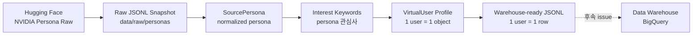

# KR Virtual User Dataset Implementation Plan

> **For agentic workers:** REQUIRED SUB-SKILL: Use superpowers:subagent-driven-development (recommended) or superpowers:executing-plans to implement this plan task-by-task. Steps use checkbox (`- [ ]`) syntax for tracking.

**Goal:** Agent Simulator의 `1.1 Virtual user data` 단계를 구현하여 NVIDIA Persona raw data를 가져오고, raw snapshot을 저장한 뒤, KR 기준으로 정규화된 virtual user profile을 1 user = 1 row 형태의 warehouse-ready 파일로 export한다.

**Architecture:** 이번 issue는 persona-only 범위이므로 기존 `autoresearch/virtual_users` 모듈 안에서 확장한다. Hugging Face 로딩, raw snapshot 저장, persona 정규화, 관심 키워드 추출, virtual user 생성, warehouse-ready JSONL export를 작은 단위로 나누고, BigQuery 적재와 Event Log 생성은 후속 issue로 분리한다.

**Tech Stack:** Python, Pydantic v2, Hugging Face `datasets`, standard-library `json`/`pathlib`, pytest.

---

## 구현 범위

이번 계획은 인프라 다이어그램의 `1.1 Virtual user data`만 다룬다.

포함 범위:

- Hugging Face `nvidia/Nemotron-Personas-Korea`에서 persona raw row를 가져온다.
- 가져온 raw row를 JSONL snapshot으로 저장한다.
- raw row를 `SourcePersona` schema로 정규화한다.
- KR 고정 필드인 `country=KR`, `locale=ko-KR`을 virtual user profile에 포함한다.
- Persona text fields에서 `interest_keywords`를 추출한다.
- Virtual user profile을 1 user = 1 row 형태의 warehouse-ready JSONL 파일로 export한다.

제외 범위:

- BigQuery load job.
- GCP credential 처리.
- Kaggle 또는 YouTube video metadata schema.
- Event Log 생성.
- 추천 API 호출.
- Feature Store 적재.

---

## 1.1 데이터 흐름



이번 PR의 산출물은 `F`까지다. `G`는 구현하지 않는다.

---

## 파일 구조

- Modify: `autoresearch/virtual_users/schema.py`
  - `SourcePersona`에 spec 기반 persona raw fields를 추가한다.
  - `VirtualUser`에 warehouse-ready fields를 추가한다.
  - `VirtualUser.to_warehouse_row()`를 추가한다.
  - `GenerationRequest`에 raw/warehouse output path를 추가한다.

- Modify: `autoresearch/virtual_users/persona_source.py`
  - raw Hugging Face row snapshot 저장 함수를 추가한다.
  - `source_persona_from_record()`가 추가 persona fields를 매핑하도록 확장한다.
  - `load_nvidia_persona_records()`에서 raw snapshot 저장 옵션을 받을 수 있게 한다.

- Create: `autoresearch/virtual_users/interests.py`
  - `SourcePersona`에서 deterministic `interest_keywords`를 추출한다.
  - LLM 없이 테스트 가능한 MVP keyword extractor로 시작한다.

- Modify: `autoresearch/virtual_users/gemini_generator.py`
  - Rule-based generator와 Gemini prompt가 새 virtual user fields를 채우도록 수정한다.
  - 생성된 user가 source persona의 `country`, `locale`, `district`를 유지하는지 검증한다.

- Modify: `autoresearch/virtual_users/pipeline.py`
  - 기존 batch JSON output은 유지한다.
  - 추가로 warehouse-ready JSONL output을 저장한다.

- Modify/Create tests:
  - `tests/test_virtual_users_schema.py`
  - `tests/test_virtual_users_persona_source.py`
  - `tests/test_virtual_users_gemini_generator.py`
  - `tests/test_virtual_users_pipeline.py`
  - `tests/test_virtual_users_interests.py`

---

## Task 세분화 검토

Task는 “데이터가 변하는 경계” 기준으로 나누었다. 이 단위가 적절한 이유는 각 Task가 독립적으로 실패 테스트를 만들 수 있고, 통과 후에는 하나의 작은 커밋으로 의미가 분명해지기 때문이다.

| Task | 분리 이유 | 독립 검증 기준 |
|---|---|---|
| Task 1. Schema 확장 | 모든 downstream 코드가 의존하는 데이터 계약을 먼저 고정해야 한다 | Pydantic model validation과 `to_warehouse_row()` 테스트 |
| Task 2. Raw snapshot 저장 | Hugging Face 원본을 보존해야 재현성과 디버깅이 가능하다 | raw JSONL 파일이 원본 row를 보존하는지 테스트 |
| Task 3. Interest keyword 추출 | 관심사 추출은 LLM/generator와 분리해야 deterministic하게 테스트할 수 있다 | 동일 persona 입력에서 동일 keyword list 반환 |
| Task 4. Generator 필드 반영 | schema가 확장되어도 실제 생성기가 값을 채우지 않으면 output이 비어 있게 된다 | rule-based generator가 KR/keyword/warehouse fields를 채우는지 테스트 |
| Task 5. Warehouse JSONL export | 기존 batch JSON과 warehouse row output은 목적이 다르므로 별도 writer로 분리한다 | 1 user = 1 JSONL row 생성 테스트 |
| Task 6. Hugging Face loader 연결 | raw snapshot 저장 기능을 실제 loader 흐름에 연결하는 integration 성격이다 | monkeypatch dataset으로 raw snapshot까지 저장되는지 테스트 |
| Task 7. 전체 검증 | task별 pass 이후 전체 suite와 diff를 확인해 회귀를 막는다 | `pytest -v`, `git diff`, `git status` |

세분화 상태는 적절하다. 더 작게 나누면 커밋 수만 늘고 같은 파일을 반복해서 만지는 비용이 커진다. 더 크게 합치면 schema, raw 저장, generator, export 문제가 한 번에 섞여서 실패 원인을 추적하기 어려워진다.

---

### Task 1: Persona And Virtual User Schema 확장

**Files:**

- Modify: `autoresearch/virtual_users/schema.py`
- Test: `tests/test_virtual_users_schema.py`

**목적:** raw persona와 virtual user의 데이터 계약을 먼저 고정한다. 이후 task들은 이 schema를 기준으로 구현된다.

- [x] **Step 1: 실패하는 schema test 작성**

`tests/test_virtual_users_schema.py`에 아래 테스트를 추가한다.

```python
def test_source_persona_accepts_spec_fields_and_kr_defaults():
    persona = SourcePersona(
        uuid="p-001",
        age=24,
        sex="female",
        occupation="student",
        province="Seoul",
        district="Mapo-gu",
        persona="A student who enjoys music and lifestyle videos.",
        hobbies_and_interests="music, beauty, lifestyle",
        hobbies_and_interests_list=["music", "beauty"],
        professional_persona="Early career learner.",
        skills_and_expertise="presentation, design",
        sports_persona="Light sports highlights viewer.",
        arts_persona="Interested in popular music.",
        travel_persona="Enjoys Seoul cafe trip videos.",
        culinary_persona="Watches cooking shorts.",
        family_persona="Lives with family.",
    )

    assert persona.country == "KR"
    assert persona.locale == "ko-KR"
    assert persona.hobbies_and_interests_list == ["music", "beauty"]
    assert persona.skills_and_expertise == "presentation, design"
    assert persona.travel_persona == "Enjoys Seoul cafe trip videos."
    assert persona.culinary_persona == "Watches cooking shorts."
    assert persona.family_persona == "Lives with family."


def test_virtual_user_exports_warehouse_ready_row():
    user = VirtualUser(
        virtual_user_id="vu_0001",
        source_uuid="p-001",
        source_dataset="nvidia/Nemotron-Personas-Korea",
        country="KR",
        locale="ko-KR",
        age=24,
        sex="female",
        age_bucket="20s",
        occupation="student",
        province="Seoul",
        district="Mapo-gu",
        persona_summary="Student interested in music and lifestyle.",
        interest_keywords=["music", "beauty", "lifestyle"],
        youtube_profile={
            "primary_categories": ["Music", "Howto & Style"],
            "shorts_affinity": 0.82,
            "longform_affinity": 0.38,
            "trend_sensitivity": 0.71,
            "comment_propensity": 0.24,
            "watch_time_band": "night",
        },
        generation_meta={
            "schema_version": GENERATION_SCHEMA_VERSION,
            "prompt_version": PROMPT_VERSION,
            "llm_model": "fixture",
            "generated_at": "2026-07-01T00:00:00+00:00",
        },
    )

    row = user.to_warehouse_row()

    assert row == {
        "user_id": "vu_0001",
        "source_uuid": "p-001",
        "source_dataset": "nvidia/Nemotron-Personas-Korea",
        "country": "KR",
        "locale": "ko-KR",
        "age": 24,
        "sex": "female",
        "occupation": "student",
        "province": "Seoul",
        "district": "Mapo-gu",
        "persona_summary": "Student interested in music and lifestyle.",
        "interest_keywords": ["music", "beauty", "lifestyle"],
        "primary_categories": ["Music", "Howto & Style"],
        "shorts_affinity": 0.82,
        "longform_affinity": 0.38,
        "trend_sensitivity": 0.71,
        "comment_propensity": 0.24,
        "watch_time_band": "night",
        "schema_version": GENERATION_SCHEMA_VERSION,
        "prompt_version": PROMPT_VERSION,
        "llm_model": "fixture",
        "generated_at": "2026-07-01T00:00:00+00:00",
    }
```

- [x] **Step 2: 실패 확인**

Run:

```bash
pytest tests/test_virtual_users_schema.py -v
```

Expected:

```text
FAILED tests/test_virtual_users_schema.py::test_source_persona_accepts_spec_fields_and_kr_defaults
FAILED tests/test_virtual_users_schema.py::test_virtual_user_exports_warehouse_ready_row
```

- [x] **Step 3: schema 구현**

`autoresearch/virtual_users/schema.py`에서 `GenerationRequest`, `SourcePersona`, `VirtualUser`를 아래 형태로 확장한다.

```python
class GenerationRequest(BaseModel):
    age_min: int = 20
    age_max: int = 29
    male_count: int = 50
    female_count: int = 50
    seed: int = 42
    use_gemini: bool = True
    source_mode: Literal["huggingface", "fixture"] = "huggingface"
    output_path: str = "data/generated/virtual_users_20s_100.json"
    raw_output_path: str = "data/raw/personas/nvidia_personas_kr.jsonl"
    warehouse_output_path: str = "data/generated/virtual_users_kr.jsonl"

    @field_validator("age_min", "age_max", "male_count", "female_count")
    @classmethod
    def non_negative(cls, value: int) -> int:
        if value < 0:
            raise ValueError("Generation counts and ages must be non-negative")
        return value

    @field_validator("age_max")
    @classmethod
    def valid_age_range(cls, value: int, info) -> int:
        age_min = info.data.get("age_min")
        if age_min is not None and value < age_min:
            raise ValueError("age_max must be greater than or equal to age_min")
        return value


class SourcePersona(BaseModel):
    uuid: str
    age: int
    sex: Literal["male", "female"]
    occupation: str = ""
    province: str = ""
    district: str = ""
    country: str = "KR"
    locale: str = "ko-KR"
    persona: str = ""
    hobbies_and_interests: str = ""
    hobbies_and_interests_list: list[str] = Field(default_factory=list)
    professional_persona: str = ""
    skills_and_expertise: str = ""
    sports_persona: str = ""
    arts_persona: str = ""
    travel_persona: str = ""
    culinary_persona: str = ""
    family_persona: str = ""
    cultural_background: str = ""


class VirtualUser(BaseModel):
    virtual_user_id: str
    source_uuid: str
    source_dataset: str = SOURCE_DATASET
    country: str = "KR"
    locale: str = "ko-KR"
    age: int
    sex: Literal["male", "female"]
    age_bucket: str
    occupation: str
    province: str
    district: str = ""
    persona_summary: str
    interest_keywords: list[str] = Field(default_factory=list)
    youtube_profile: YouTubeProfile
    generation_meta: GenerationMeta

    def to_warehouse_row(self) -> dict[str, object]:
        return {
            "user_id": self.virtual_user_id,
            "source_uuid": self.source_uuid,
            "source_dataset": self.source_dataset,
            "country": self.country,
            "locale": self.locale,
            "age": self.age,
            "sex": self.sex,
            "occupation": self.occupation,
            "province": self.province,
            "district": self.district,
            "persona_summary": self.persona_summary,
            "interest_keywords": self.interest_keywords,
            "primary_categories": self.youtube_profile.primary_categories,
            "shorts_affinity": self.youtube_profile.shorts_affinity,
            "longform_affinity": self.youtube_profile.longform_affinity,
            "trend_sensitivity": self.youtube_profile.trend_sensitivity,
            "comment_propensity": self.youtube_profile.comment_propensity,
            "watch_time_band": self.youtube_profile.watch_time_band,
            "schema_version": self.generation_meta.schema_version,
            "prompt_version": self.generation_meta.prompt_version,
            "llm_model": self.generation_meta.llm_model,
            "generated_at": self.generation_meta.generated_at,
        }
```

- [x] **Step 4: 통과 확인**

Run:

```bash
pytest tests/test_virtual_users_schema.py -v
```

Expected:

```text
tests/test_virtual_users_schema.py::test_source_persona_accepts_spec_fields_and_kr_defaults PASSED
tests/test_virtual_users_schema.py::test_virtual_user_exports_warehouse_ready_row PASSED
```

- [x] **Step 5: commit**

Run:

```bash
git add autoresearch/virtual_users/schema.py tests/test_virtual_users_schema.py
git commit -m "feat: extend virtual user warehouse schema"
```

---

### Task 2: Raw Persona Snapshot 저장

**Files:**

- Modify: `autoresearch/virtual_users/persona_source.py`
- Test: `tests/test_virtual_users_persona_source.py`

**목적:** 원본 raw data를 저장해 생성 결과를 재현 가능하게 만든다. 나중에 virtual user row가 이상할 때 어떤 원본 row에서 왔는지 추적할 수 있다.

- [x] **Step 1: 실패하는 raw snapshot test 작성**

`tests/test_virtual_users_persona_source.py`에 아래 테스트를 추가한다. 기존 import가 있으면 중복 없이 합친다.

```python
import json

import autoresearch.virtual_users.persona_source as persona_source
from autoresearch.virtual_users.persona_source import (
    source_persona_from_record,
)


def test_write_raw_persona_records_creates_jsonl_snapshot(tmp_path):
    output_path = tmp_path / "raw_personas.jsonl"
    raw_records = [
        {
            "uuid": "p-001",
            "age": 24,
            "sex": "female",
            "occupation": "student",
            "persona": "A student interested in music.",
        },
        {
            "uuid": "p-002",
            "age": 25,
            "sex": "male",
            "occupation": "developer",
            "persona": "A developer interested in gaming.",
        },
    ]

    persona_source.write_raw_persona_records(raw_records, output_path)

    lines = output_path.read_text(encoding="utf-8").splitlines()
    assert len(lines) == 2
    assert json.loads(lines[0])["uuid"] == "p-001"
    assert json.loads(lines[1])["uuid"] == "p-002"


def test_source_persona_from_record_maps_spec_fields():
    persona = source_persona_from_record(
        {
            "uuid": "p-001",
            "age": 24,
            "sex": "female",
            "occupation": "student",
            "province": "Seoul",
            "district": "Mapo-gu",
            "persona": "Enjoys music videos.",
            "hobbies_and_interests": "music, beauty",
            "hobbies_and_interests_list": ["music", "beauty"],
            "professional_persona": "Learner.",
            "skills_and_expertise": "design",
            "sports_persona": "Light sports viewer.",
            "arts_persona": "Music fan.",
            "travel_persona": "Cafe trips.",
            "culinary_persona": "Cooking shorts.",
            "family_persona": "Family lifestyle.",
            "cultural_background": "Korean urban media user.",
        }
    )

    assert persona.country == "KR"
    assert persona.locale == "ko-KR"
    assert persona.hobbies_and_interests_list == ["music", "beauty"]
    assert persona.skills_and_expertise == "design"
    assert persona.travel_persona == "Cafe trips."
    assert persona.culinary_persona == "Cooking shorts."
    assert persona.family_persona == "Family lifestyle."
```

- [x] **Step 2: 실패 확인**

Run:

```bash
pytest tests/test_virtual_users_persona_source.py -v
```

Expected:

```text
FAILED tests/test_virtual_users_persona_source.py::test_write_raw_persona_records_creates_jsonl_snapshot
FAILED tests/test_virtual_users_persona_source.py::test_source_persona_from_record_maps_spec_fields
```

- [x] **Step 3: raw writer와 field mapping 구현**

`autoresearch/virtual_users/persona_source.py` import를 아래처럼 확장한다.

```python
import json
import logging
import random
from collections.abc import Iterable
from pathlib import Path
from typing import Any
```

`_as_text` 아래에 helper를 추가한다.

```python
def _as_text_list(record: dict[str, Any], key: str) -> list[str]:
    value = record.get(key, [])
    if value is None:
        return []
    if isinstance(value, list):
        return [str(item) for item in value if str(item).strip()]
    return [part.strip() for part in str(value).split(",") if part.strip()]
```

`source_persona_from_record()`를 아래처럼 교체한다.

```python
def source_persona_from_record(record: dict[str, Any]) -> SourcePersona:
    persona = SourcePersona(
        uuid=_as_text(record, "uuid"),
        age=int(record["age"]),
        sex=normalize_sex(record["sex"]),
        occupation=_as_text(record, "occupation"),
        province=_as_text(record, "province"),
        district=_as_text(record, "district"),
        persona=_as_text(record, "persona"),
        hobbies_and_interests=_as_text(record, "hobbies_and_interests"),
        hobbies_and_interests_list=_as_text_list(record, "hobbies_and_interests_list"),
        professional_persona=_as_text(record, "professional_persona"),
        skills_and_expertise=_as_text(record, "skills_and_expertise"),
        sports_persona=_as_text(record, "sports_persona"),
        arts_persona=_as_text(record, "arts_persona"),
        travel_persona=_as_text(record, "travel_persona"),
        culinary_persona=_as_text(record, "culinary_persona"),
        family_persona=_as_text(record, "family_persona"),
        cultural_background=_as_text(record, "cultural_background"),
    )
    logger.debug(
        "Converted raw persona record",
        extra={
            "source_uuid": persona.uuid,
            "age": persona.age,
            "sex": persona.sex,
            "province": persona.province,
            "country": persona.country,
            "locale": persona.locale,
        },
    )
    return persona
```

`source_persona_from_record()` 아래에 writer를 추가한다.

```python
def write_raw_persona_records(
    records: Iterable[dict[str, Any]],
    output_path: str | Path,
) -> None:
    path = Path(output_path)
    path.parent.mkdir(parents=True, exist_ok=True)
    with path.open("w", encoding="utf-8") as file:
        for record in records:
            file.write(json.dumps(record, ensure_ascii=False, default=str) + "\n")
    logger.info("Wrote raw persona snapshot", extra={"output_path": str(path)})
```

- [x] **Step 4: 통과 확인**

Run:

```bash
pytest tests/test_virtual_users_persona_source.py -v
```

Expected:

```text
tests/test_virtual_users_persona_source.py::test_write_raw_persona_records_creates_jsonl_snapshot PASSED
tests/test_virtual_users_persona_source.py::test_source_persona_from_record_maps_spec_fields PASSED
```

- [x] **Step 5: commit**

Run:

```bash
git add autoresearch/virtual_users/persona_source.py tests/test_virtual_users_persona_source.py
git commit -m "feat: persist raw persona snapshots"
```

---

### Task 3: Deterministic Interest Keyword 추출

**Files:**

- Create: `autoresearch/virtual_users/interests.py`
- Test: `tests/test_virtual_users_interests.py`

**목적:** spec.md의 “Persona -> 관심사 추출” 요구사항을 LLM과 분리된 deterministic 함수로 구현한다.

- [x] **Step 1: 실패하는 interest extraction test 작성**

`tests/test_virtual_users_interests.py`를 생성한다.

```python
from autoresearch.virtual_users.interests import extract_interest_keywords
from autoresearch.virtual_users.schema import SourcePersona


def test_extract_interest_keywords_uses_spec_persona_fields():
    persona = SourcePersona(
        uuid="p-001",
        age=24,
        sex="female",
        persona="Enjoys music videos and lifestyle creators.",
        hobbies_and_interests="beauty, study videos",
        hobbies_and_interests_list=["music", "beauty"],
        professional_persona="Early career learner.",
        skills_and_expertise="design and presentation",
        sports_persona="Light sports viewer.",
        arts_persona="Popular music fan.",
        travel_persona="Cafe trip videos.",
        culinary_persona="Cooking shorts.",
        family_persona="Family lifestyle.",
    )

    keywords = extract_interest_keywords(persona)

    assert keywords == [
        "music",
        "beauty",
        "study",
        "design",
        "sports",
        "travel",
        "cooking",
        "lifestyle",
    ]


def test_extract_interest_keywords_returns_general_when_no_match():
    persona = SourcePersona(
        uuid="p-002",
        age=26,
        sex="male",
        persona="No clear media preference is present.",
    )

    assert extract_interest_keywords(persona) == ["general"]
```

- [x] **Step 2: 실패 확인**

Run:

```bash
pytest tests/test_virtual_users_interests.py -v
```

Expected:

```text
ModuleNotFoundError: No module named 'autoresearch.virtual_users.interests'
```

- [x] **Step 3: interest extractor 구현**

`autoresearch/virtual_users/interests.py`를 생성한다.

```python
from autoresearch.virtual_users.schema import SourcePersona


KEYWORD_ALIASES: dict[str, tuple[str, ...]] = {
    "music": ("music", "song", "artist", "playlist"),
    "beauty": ("beauty", "makeup", "fashion", "style"),
    "study": ("study", "learning", "education", "learner"),
    "design": ("design", "presentation", "creative"),
    "sports": ("sports", "football", "baseball", "basketball"),
    "travel": ("travel", "trip", "cafe"),
    "cooking": ("cooking", "culinary", "recipe", "food"),
    "lifestyle": ("lifestyle", "family", "home", "daily"),
    "gaming": ("game", "gaming", "esports"),
    "technology": ("technology", "tech", "developer", "software"),
}


def _persona_text(persona: SourcePersona) -> str:
    parts = [
        persona.persona,
        persona.hobbies_and_interests,
        " ".join(persona.hobbies_and_interests_list),
        persona.professional_persona,
        persona.skills_and_expertise,
        persona.sports_persona,
        persona.arts_persona,
        persona.travel_persona,
        persona.culinary_persona,
        persona.family_persona,
        persona.cultural_background,
    ]
    return " ".join(part for part in parts if part).lower()


def extract_interest_keywords(persona: SourcePersona, limit: int = 10) -> list[str]:
    text = _persona_text(persona)
    keywords: list[str] = []
    for keyword, aliases in KEYWORD_ALIASES.items():
        if any(alias in text for alias in aliases):
            keywords.append(keyword)

    if not keywords:
        return ["general"]
    return keywords[:limit]
```

- [x] **Step 4: 통과 확인**

Run:

```bash
pytest tests/test_virtual_users_interests.py -v
```

Expected:

```text
tests/test_virtual_users_interests.py::test_extract_interest_keywords_uses_spec_persona_fields PASSED
tests/test_virtual_users_interests.py::test_extract_interest_keywords_returns_general_when_no_match PASSED
```

- [x] **Step 5: commit**

Run:

```bash
git add autoresearch/virtual_users/interests.py tests/test_virtual_users_interests.py
git commit -m "feat: extract virtual user interest keywords"
```

---

### Task 4: Generator에 Warehouse Fields 반영

**Files:**

- Modify: `autoresearch/virtual_users/gemini_generator.py`
- Test: `tests/test_virtual_users_gemini_generator.py`

**목적:** schema만 확장하면 실제 output에는 값이 비어 있을 수 있으므로, rule-based generator와 Gemini prompt 모두 새 field를 생성하도록 만든다.

- [ ] **Step 1: 실패하는 generator test 작성**

`tests/test_virtual_users_gemini_generator.py`에 아래 테스트를 추가한다. 기존 import가 있으면 합친다.

```python
from autoresearch.virtual_users.gemini_generator import RuleBasedVirtualUserGenerator
from autoresearch.virtual_users.schema import SOURCE_DATASET, SourcePersona


def test_rule_based_generator_populates_warehouse_fields():
    persona = SourcePersona(
        uuid="p-001",
        age=24,
        sex="female",
        occupation="student",
        province="Seoul",
        district="Mapo-gu",
        persona="Enjoys music videos and lifestyle creators.",
        hobbies_and_interests="beauty, study videos",
        hobbies_and_interests_list=["music", "beauty"],
    )

    user = RuleBasedVirtualUserGenerator().generate(persona, virtual_user_id="vu_0001")

    assert user.virtual_user_id == "vu_0001"
    assert user.source_uuid == "p-001"
    assert user.source_dataset == SOURCE_DATASET
    assert user.country == "KR"
    assert user.locale == "ko-KR"
    assert user.district == "Mapo-gu"
    assert user.interest_keywords == ["music", "beauty", "study", "lifestyle"]
```

- [ ] **Step 2: 실패 확인**

Run:

```bash
pytest tests/test_virtual_users_gemini_generator.py -v
```

Expected:

```text
FAILED tests/test_virtual_users_gemini_generator.py::test_rule_based_generator_populates_warehouse_fields
```

- [ ] **Step 3: generator import와 prompt contract 수정**

`autoresearch/virtual_users/gemini_generator.py`에 import를 추가한다.

```python
from autoresearch.virtual_users.interests import extract_interest_keywords
```

`build_virtual_user_prompt()`의 Required JSON shape에 아래 field를 포함한다.

```python
  "source_dataset": "nvidia/Nemotron-Personas-Korea",
  "country": "KR",
  "locale": "ko-KR",
```

profile field 근처에 아래 field를 포함한다.

```python
  "district": "{persona.district}",
  "interest_keywords": ["music", "gaming"],
```

Constraints에 아래 문장을 추가한다.

```python
- Keep original district, country, locale, and source_uuid.
- interest_keywords must be a list of concise lowercase English keywords.
```

- [ ] **Step 4: source field validation 확장**

`_ensure_source_persona_matches_user()`의 `expected`를 아래처럼 바꾼다.

```python
    expected = {
        "virtual_user_id": virtual_user_id,
        "source_uuid": persona.uuid,
        "age": persona.age,
        "sex": persona.sex,
        "occupation": persona.occupation,
        "province": persona.province,
        "district": persona.district,
        "country": persona.country,
        "locale": persona.locale,
    }
```

`actual`을 아래처럼 바꾼다.

```python
    actual = {
        "virtual_user_id": user.virtual_user_id,
        "source_uuid": user.source_uuid,
        "age": user.age,
        "sex": user.sex,
        "occupation": user.occupation,
        "province": user.province,
        "district": user.district,
        "country": user.country,
        "locale": user.locale,
    }
```

- [ ] **Step 5: rule-based generator output 수정**

`RuleBasedVirtualUserGenerator.generate()`에서 `VirtualUser` 생성 전 아래 줄을 추가한다.

```python
        interest_keywords = extract_interest_keywords(persona)
```

`VirtualUser(...)` 생성자에 아래 field들을 추가한다.

```python
            source_dataset=SOURCE_DATASET,
            country=persona.country,
            locale=persona.locale,
            district=persona.district,
            interest_keywords=interest_keywords,
```

- [ ] **Step 6: 통과 확인**

Run:

```bash
pytest tests/test_virtual_users_gemini_generator.py -v
```

Expected:

```text
tests/test_virtual_users_gemini_generator.py::test_rule_based_generator_populates_warehouse_fields PASSED
```

- [ ] **Step 7: commit**

Run:

```bash
git add autoresearch/virtual_users/gemini_generator.py tests/test_virtual_users_gemini_generator.py
git commit -m "feat: populate warehouse fields in virtual users"
```

---

### Task 5: Warehouse-ready JSONL Export 추가

**Files:**

- Modify: `autoresearch/virtual_users/pipeline.py`
- Test: `tests/test_virtual_users_pipeline.py`

**목적:** 기존 batch JSON은 디버깅/메타데이터 포함 output이고, warehouse-ready JSONL은 적재 직전 row output이다. 목적이 다르므로 별도 writer로 분리한다.

- [ ] **Step 1: 실패하는 pipeline export test 작성**

`tests/test_virtual_users_pipeline.py`에 아래 테스트를 추가한다.

```python
def test_generate_virtual_user_batch_writes_warehouse_jsonl(tmp_path):
    records = build_fixture_persona_records(male_count=5, female_count=5)
    batch_output_path = tmp_path / "virtual_users_batch.json"
    warehouse_output_path = tmp_path / "virtual_users_kr.jsonl"
    request = GenerationRequest(
        male_count=1,
        female_count=1,
        seed=7,
        use_gemini=False,
        source_mode="fixture",
        output_path=str(batch_output_path),
        warehouse_output_path=str(warehouse_output_path),
    )

    generate_virtual_user_batch(
        request=request,
        records=records,
        generator=RuleBasedVirtualUserGenerator(),
    )

    lines = warehouse_output_path.read_text(encoding="utf-8").splitlines()
    rows = [json.loads(line) for line in lines]

    assert len(rows) == 2
    assert rows[0]["user_id"].startswith("vu_")
    assert rows[0]["source_dataset"] == "nvidia/Nemotron-Personas-Korea"
    assert rows[0]["country"] == "KR"
    assert rows[0]["locale"] == "ko-KR"
    assert isinstance(rows[0]["interest_keywords"], list)
    assert "primary_categories" in rows[0]
    assert "watch_time_band" in rows[0]
```

- [ ] **Step 2: 실패 확인**

Run:

```bash
pytest tests/test_virtual_users_pipeline.py::test_generate_virtual_user_batch_writes_warehouse_jsonl -v
```

Expected:

```text
FileNotFoundError
```

- [ ] **Step 3: pipeline에 JSONL writer 구현**

`autoresearch/virtual_users/pipeline.py`에서 `generate_virtual_user_batch()` 위에 helper를 추가한다.

```python
def write_virtual_users_warehouse_jsonl(
    batch: VirtualUserBatch,
    output_path: str | Path,
) -> None:
    path = Path(output_path)
    path.parent.mkdir(parents=True, exist_ok=True)
    with path.open("w", encoding="utf-8") as file:
        for user in batch.users:
            file.write(
                json.dumps(user.to_warehouse_row(), ensure_ascii=False, default=str)
                + "\n"
            )
    logger.info(
        "Wrote warehouse-ready virtual user output",
        extra={"output_path": str(path), "total": len(batch.users)},
    )
```

기존 batch JSON 저장 직후 아래 호출을 추가한다.

```python
    write_virtual_users_warehouse_jsonl(
        batch=batch,
        output_path=request.warehouse_output_path,
    )
```

- [ ] **Step 4: 통과 확인**

Run:

```bash
pytest tests/test_virtual_users_pipeline.py::test_generate_virtual_user_batch_writes_warehouse_jsonl -v
```

Expected:

```text
tests/test_virtual_users_pipeline.py::test_generate_virtual_user_batch_writes_warehouse_jsonl PASSED
```

- [ ] **Step 5: commit**

Run:

```bash
git add autoresearch/virtual_users/pipeline.py tests/test_virtual_users_pipeline.py
git commit -m "feat: export warehouse-ready virtual users"
```

---

### Task 6: Hugging Face Loader에 Raw Snapshot 연결

**Files:**

- Modify: `autoresearch/virtual_users/persona_source.py`
- Test: `tests/test_virtual_users_persona_source.py`

**목적:** Task 2에서 만든 raw snapshot writer를 실제 Hugging Face loader 흐름에 연결한다. 이 task는 외부 dataset 호출을 monkeypatch해서 네트워크 없이 검증한다.

- [ ] **Step 1: 실패하는 loader test 작성**

`tests/test_virtual_users_persona_source.py`에 아래 테스트를 추가한다.

```python
def test_load_nvidia_persona_records_can_write_raw_snapshot(monkeypatch, tmp_path):
    raw_records = [
        {
            "uuid": "p-001",
            "age": 24,
            "sex": "female",
            "occupation": "student",
            "persona": "Music fan.",
        },
        {
            "uuid": "p-002",
            "age": 25,
            "sex": "male",
            "occupation": "developer",
            "persona": "Gaming fan.",
        },
    ]

    def fake_load_dataset(name, split, streaming):
        assert name == "nvidia/Nemotron-Personas-Korea"
        assert split == "train"
        assert streaming is True
        return raw_records

    import autoresearch.virtual_users.persona_source as persona_source

    monkeypatch.setattr(persona_source, "load_dataset", fake_load_dataset, raising=False)

    output_path = tmp_path / "raw_snapshot.jsonl"
    records = persona_source.load_nvidia_persona_records(
        max_records=2,
        raw_output_path=output_path,
    )

    assert [record.uuid for record in records] == ["p-001", "p-002"]
    lines = output_path.read_text(encoding="utf-8").splitlines()
    assert len(lines) == 2
    assert json.loads(lines[0])["uuid"] == "p-001"
```

- [ ] **Step 2: 실패 확인**

Run:

```bash
pytest tests/test_virtual_users_persona_source.py::test_load_nvidia_persona_records_can_write_raw_snapshot -v
```

Expected:

```text
TypeError: load_nvidia_persona_records() got an unexpected keyword argument 'raw_output_path'
```

- [ ] **Step 3: `load_dataset` import 위치 변경**

`autoresearch/virtual_users/persona_source.py` 상단에 추가한다.

```python
from datasets import load_dataset
```

`load_nvidia_persona_records()` 내부의 local import는 제거한다.

- [ ] **Step 4: loader signature와 raw persistence 구현**

`load_nvidia_persona_records()`를 아래처럼 교체한다.

```python
def load_nvidia_persona_records(
    max_records: int | None = None,
    raw_output_path: str | Path | None = None,
) -> list[SourcePersona]:
    logger.info(
        "Loading NVIDIA persona records",
        extra={"source_dataset": SOURCE_DATASET, "max_records": max_records},
    )
    dataset = load_dataset(SOURCE_DATASET, split="train", streaming=True)
    raw_records: list[dict[str, Any]] = []
    records: list[SourcePersona] = []
    skipped = 0

    for raw_record in dataset:
        raw_payload = dict(raw_record)
        raw_records.append(raw_payload)
        try:
            records.append(source_persona_from_record(raw_payload))
        except (KeyError, TypeError, ValueError):
            skipped += 1
            logger.debug("Skipped invalid persona record", exc_info=True)
            continue
        if max_records is not None and len(records) >= max_records:
            break

    if raw_output_path is not None:
        write_raw_persona_records(raw_records, raw_output_path)

    logger.info(
        "Loaded NVIDIA persona records",
        extra={
            "source_dataset": SOURCE_DATASET,
            "loaded_count": len(records),
            "skipped_count": skipped,
        },
    )
    return records
```

- [ ] **Step 5: 통과 확인**

Run:

```bash
pytest tests/test_virtual_users_persona_source.py::test_load_nvidia_persona_records_can_write_raw_snapshot -v
```

Expected:

```text
tests/test_virtual_users_persona_source.py::test_load_nvidia_persona_records_can_write_raw_snapshot PASSED
```

- [ ] **Step 6: commit**

Run:

```bash
git add autoresearch/virtual_users/persona_source.py tests/test_virtual_users_persona_source.py
git commit -m "feat: snapshot raw huggingface personas"
```

---

### Task 7: 전체 검증

**Files:**

- Verify all touched implementation and test files.

**목적:** task별 테스트가 통과해도 전체 suite에서 기존 기능이 깨질 수 있으므로 마지막에 전체 검증을 수행한다.

- [ ] **Step 1: 전체 테스트 실행**

Run:

```bash
pytest -v
```

Expected:

```text
passed
```

- [ ] **Step 2: diff 검토**

Run:

```bash
git diff --stat
git diff -- autoresearch/virtual_users tests
```

Expected:

```text
Only virtual user implementation and virtual user tests are changed.
```

- [ ] **Step 3: branch 상태 확인**

Run:

```bash
git status --short --branch
```

Expected:

```text
## 19-feat-nvidia-persona-기반-kr-virtual-user-dataset-생성...origin/19-feat-nvidia-persona-기반-kr-virtual-user-dataset-생성 [ahead N]
```

`N`은 task별 commit 수에 따라 달라진다.

---

## Self-Review

Spec coverage:

- Hugging Face persona raw data fetch: Task 6.
- Raw data 저장: Task 2, Task 6.
- Normalized persona schema: Task 1, Task 2.
- KR 고정 field: Task 1, Task 4.
- Persona 관심사 추출: Task 3.
- Virtual user profile row 생성: Task 4.
- Warehouse-ready file export: Task 5.
- BigQuery 적재 제외: 구현 범위와 제외 범위에 명시.
- Kaggle/YouTube video metadata 제외: 구현 범위와 제외 범위에 명시.
- Event Log 생성 제외: 구현 범위와 제외 범위에 명시.

Task granularity review:

- Task 1은 schema contract만 다루므로 downstream 변경의 기반이 된다.
- Task 2는 raw 저장과 raw-to-normalized mapping을 다루므로 재현성 책임을 가진다.
- Task 3은 keyword extraction만 다루므로 LLM 없이 deterministic하게 검증된다.
- Task 4는 generator output을 schema와 연결하므로 생성 데이터의 completeness를 보장한다.
- Task 5는 warehouse-ready export만 다루므로 storage format 변경이 pipeline core logic과 섞이지 않는다.
- Task 6은 Hugging Face loader integration만 다루므로 외부 I/O 경계가 분명하다.
- Task 7은 전체 회귀 검증만 다루므로 구현 변경을 포함하지 않는다.

Placeholder scan:

- 계획에 undefined placeholder는 없다.
- 각 task는 실패 테스트, 실패 확인 명령, 구현 내용, 통과 확인 명령, commit 명령을 가진다.
- 후속 issue로 분리되는 영역은 제외 범위로 명시했으며 이번 issue의 구현 step에는 넣지 않았다.

Type consistency:

- `SourcePersona.country`와 `SourcePersona.locale`은 string default이다.
- `VirtualUser.country`와 `VirtualUser.locale`은 string default이다.
- `interest_keywords`는 모든 단계에서 `list[str]`이다.
- `raw_output_path`, `warehouse_output_path`는 `GenerationRequest`에서는 string이고 write boundary에서 `Path`로 변환한다.
- `VirtualUser.to_warehouse_row()`는 warehouse-ready JSONL row의 단일 source of truth이다.

---

## Execution Handoff

Plan complete and saved to `docs/virtual_user_data_plan.md`. Two execution options:

**1. Subagent-Driven (recommended)** - task별로 fresh subagent를 dispatch하고 task 사이에 review한다.

**2. Inline Execution** - 이 세션에서 `superpowers:executing-plans`로 task를 순서대로 실행한다.

Which approach?
