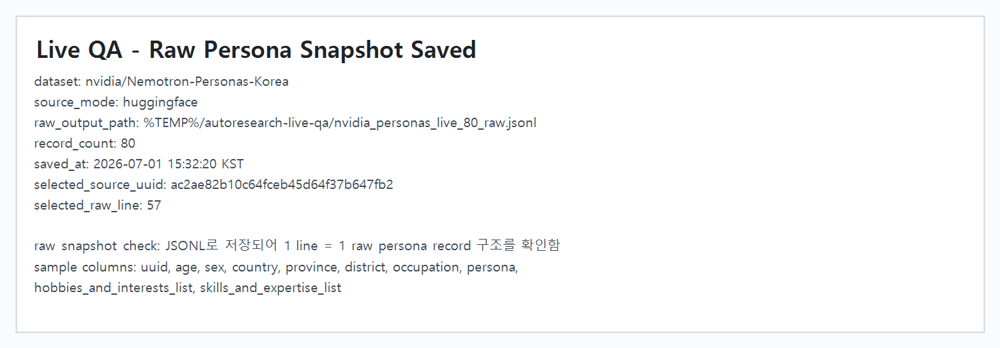
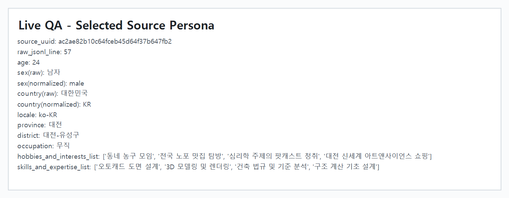
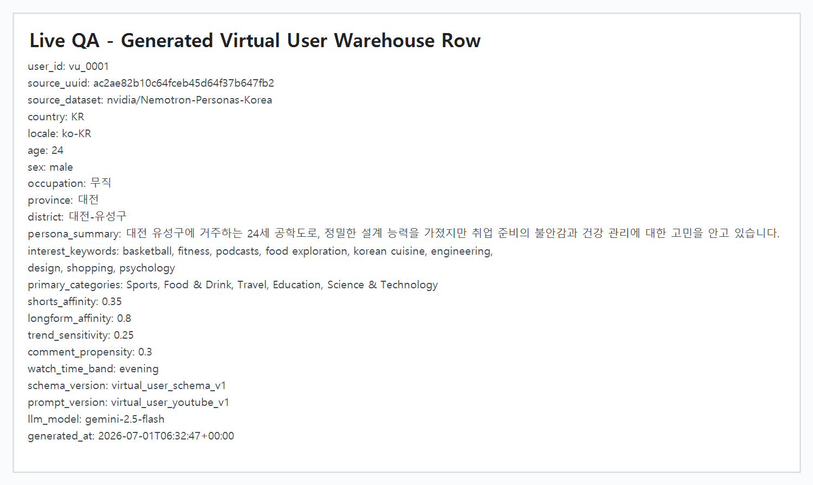

# Virtual User Live QA Evidence

Issue #19의 `1.1 Virtual User Data` 구현에 대해 실제 Hugging Face 데이터 로드와 Gemini 호출까지 연결해 확인한 결과입니다.

## 검증 범위

- Hugging Face `nvidia/Nemotron-Personas-Korea` raw persona 로드
- raw persona JSONL snapshot 저장
- 선택된 source persona 확인
- Gemini 호출을 통한 virtual user 생성
- warehouse-ready JSONL row 생성 확인

## Live QA 결과

- raw snapshot record count: 80
- selected source uuid: `ac2ae82b10c64fceb45d64f37b647fb2`
- selected raw JSONL line: 57
- generated user id: `vu_0001`
- generated model: `gemini-2.5-flash`
- output shape: 1 user = 1 warehouse-ready row

## Screenshots

### Raw Persona Snapshot 저장 확인

### 선택된 Source Persona

### 생성된 Virtual User Warehouse Row

